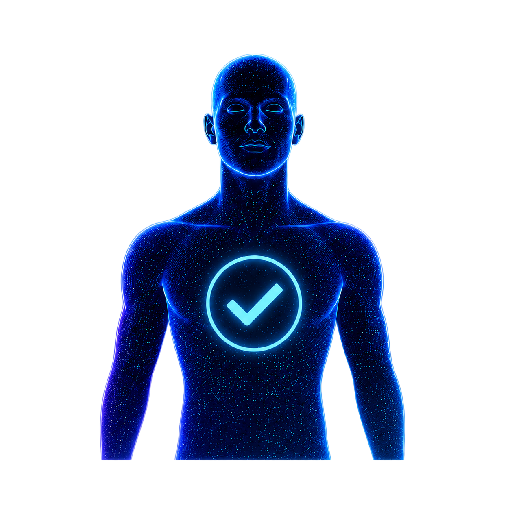
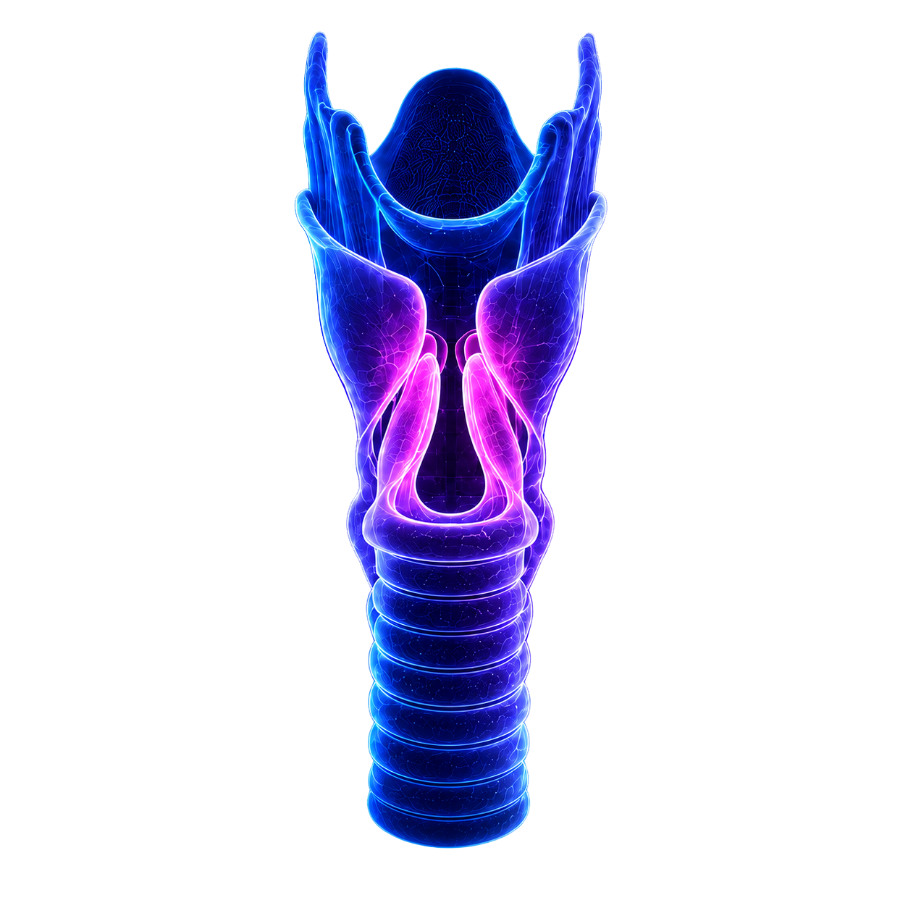
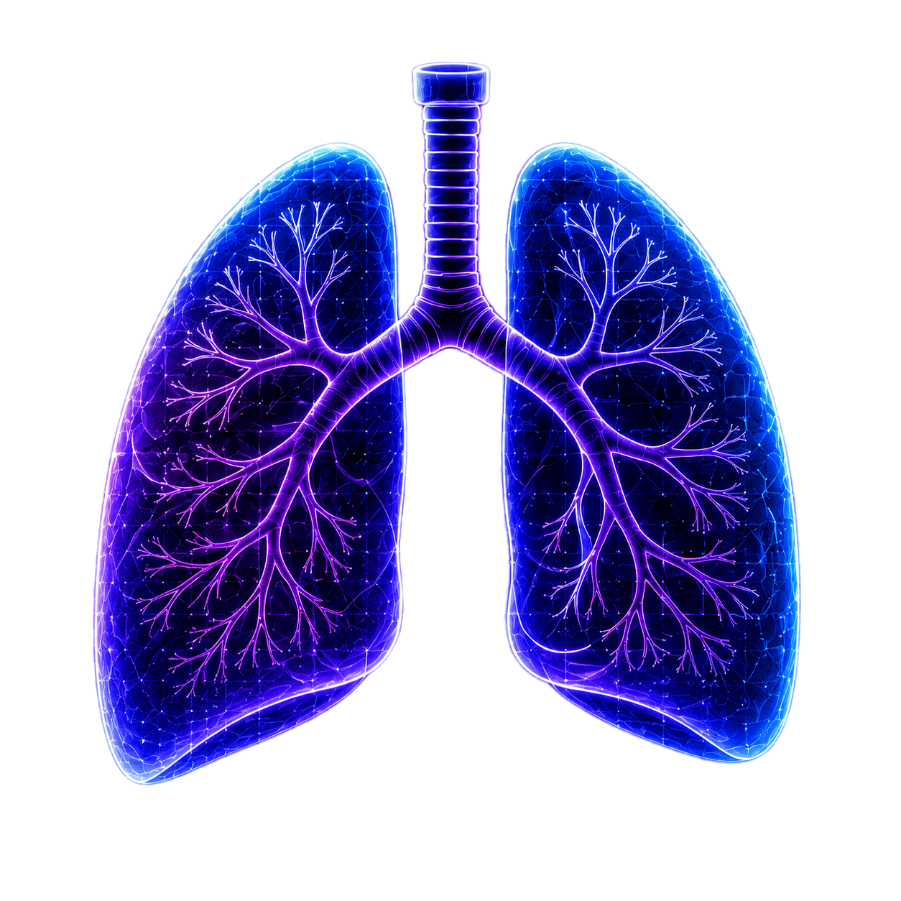
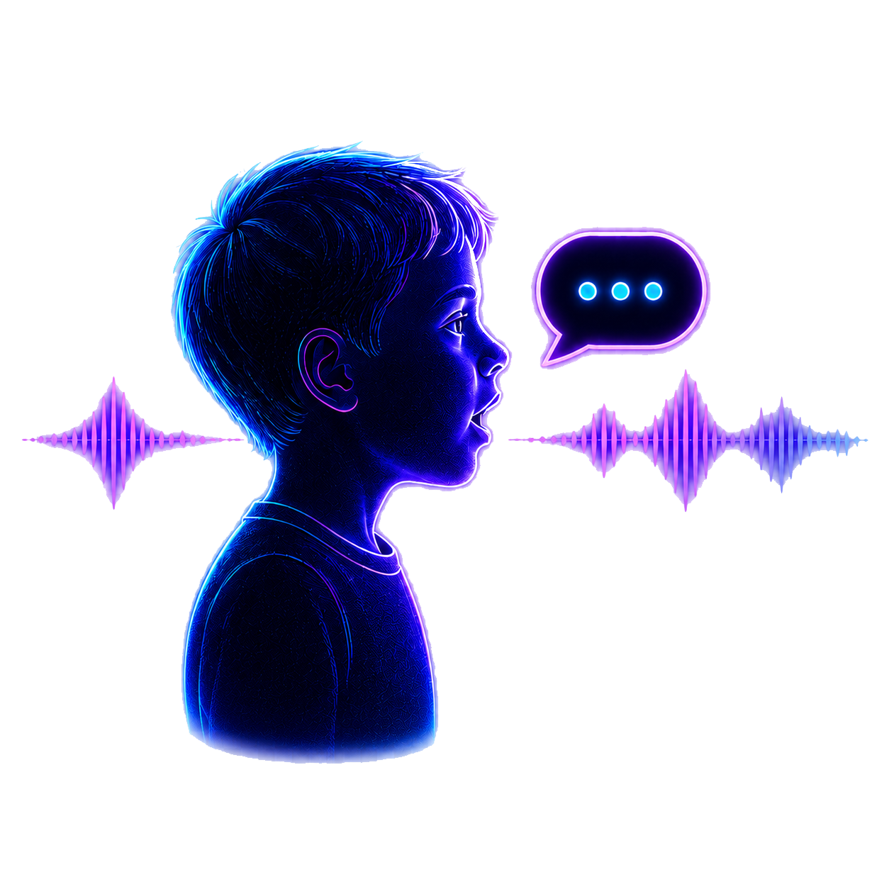

    
     
    Voice as a Biomarker of Health

# bridge2ai-redcap

Bridge2AI-Voice Protocols and REDCap resources for the Bridge2AI-Voice project.

   

| Version | Date YYYY-mm-dd |
| :-----: | :-------------: |
| v4.8.0  |   2026-06-04    |

## <picture><source media="(prefers-color-scheme: dark)" srcset="images/main_logo_white.svg"></picture> Bridge2AI-Voice Protocols

### 📋 Adult Protocols

<table align="center">
  <tr>
    <td align="center" width="20%">
      <a href="docs/Adults/Protocols/Generic%20Protocol%20(Controls).md">
          
        <strong>Generic (Controls)</strong>
      </a>
       ⏳ 38:45 📕 6 questionnaires 🎤 10 acoustic tasks 🔊 41 recordings
    </td>
    <td align="center" width="20%">
      <a href="docs/Adults/Protocols/Voice%20Disorders%20Protocol.md">
          
        <strong>Voice</strong>
      </a>
       ⏳ 42:25 📕 6 questionnaires 🎤 12 acoustic tasks 🔊 48 recordings
    </td>
    <td align="center" width="20%">
      <a href="docs/Adults/Protocols/Mood%20and%20Psychiatric%20Disorders%20Protocol.md">
          
        <strong>Mood &amp; Psychiatric</strong>
      </a>
       ⏳ 46:00 📕 10 questionnaires 🎤 10 acoustic tasks 🔊 41 recordings
    </td>
    <td align="center" width="20%">
      <a href="docs/Adults/Protocols/Respiratory%20Disorders%20Protocol.md">
          
        <strong>Respiratory</strong>
      </a>
       ⏳ 42:05 📕 8 questionnaires 🎤 10 acoustic tasks 🔊 41 recordings
    </td>
    <td align="center" width="20%">
      <a href="docs/Adults/Protocols/Neurological%20and%20Neurodegenerative%20Disorders%20Protocol.md">
          
        <strong>Neurological &amp; Neurodegenerative</strong>
      </a>
       ⏳ 45:30 📕 6 questionnaires 🎤 13 acoustic tasks 🔊 49 recordings
    </td>
  </tr>
</table>

#### Additional Resources

<table align="center">
  <tr>
    <td align="center" width="16%">
      <a href="docs/Adults/Acoustic%20Tasks/Adult%20Acoustic%20Tasks.md">
         🎤 
        <strong>All Adult Acoustic Tasks</strong>
      </a>
       🟢 15 active 🗄️ 15 retired
    </td>
    <td align="center" width="16%">
      <a href="docs/Adults/Questionnaires/Adult%20Questionnaires.md">
         📝 
        <strong>All Adult Questionnaires</strong>
      </a>
       🟢 16 active 🗄️ 4 retired
    </td>
    <td align="center" width="16%">
      <a href="docs/Adults/Diagnoses/Adult%20Diagnoses.md">
         🏥 
        <strong>All Adult Diagnoses</strong>
      </a>
       🩺 19 disorders
    </td>
    <td align="center" width="16%">
      <a href="docs/Adults/eConsents/Adult%20eConsents.md">
         ✍️ 
        <strong>eConsents</strong>
      </a>
       🏛️ 3 sites
    </td>
    <td align="center" width="16%">
      <a href="docs/Adults/PDFs/Adult%20PDFs.md">
         📄 
        <strong>All Adult PDFs</strong>
      </a>
       🌐 2 Languages 
    </td>
    <td align="center" width="16%">
      <a href="docs/Adults/Recordings/Adult%20Recordings.md">
         🔊 
        <strong>All Adult Recordings</strong>
      </a>
       🟢 56 active 🗄️ 37 retired
    </td>
  </tr>
</table>

### 📋 Pediatric Protocols

<table align="center">
  <tr>
    <td align="center" width="25%">
      <a href="docs/Pediatrics/Protocols/Pediatric%20Disorders%20-%20Ages%20%5B2-4%29.md">
          
        <strong>Ages 2–4</strong>
      </a>
       ⏳ 14:10 📕 6 questionnaires 🎤 4 acoustic tasks 🔊 50 recordings
    </td>
    <td align="center" width="25%">
      <a href="docs/Pediatrics/Protocols/Pediatric%20Disorders%20-%20Ages%20%5B4-6%29.md">
          
        <strong>Ages 4–6</strong>
      </a>
       ⏳ 14:10 📕 6 questionnaires 🎤 8 acoustic tasks 🔊 87 recordings
    </td>
    <td align="center" width="25%">
      <a href="docs/Pediatrics/Protocols/Pediatric%20Disorders%20-%20Ages%20%5B6-10%29.md">
          
        <strong>Ages 6–10</strong>
      </a>
       ⏳ 14:10 📕 6 questionnaires 🎤 9 acoustic tasks 🔊 101 recordings
    </td>
    <td align="center" width="25%">
      <a href="docs/Pediatrics/Protocols/Pediatric%20Disorders%20-%20Ages%2010%2B.md">
          
        <strong>Ages 10+</strong>
      </a>
       ⏳ 14:10 📕 6 questionnaires 🎤 9 acoustic tasks 🔊 92 recordings
    </td>
  </tr>
</table>

#### Additional Resources

<table align="center">
  <tr>
    <td align="center" width="25%">
      <a href="docs/Pediatrics/Acoustic%20Tasks/Pediatric%20Acoustic%20Tasks.md">
         🎤 
        <strong>All Pediatric Acoustic Tasks</strong>
      </a>
       🟢 15 active
    </td>
    <td align="center" width="25%">
      <a href="docs/Pediatrics/Questionnaires/Pediatric%20Questionnaires.md">
         📝 
        <strong>All Pediatric Questionnaires</strong>
      </a>
       🟢 6 active
    </td>
    <td align="center" width="25%">
      <a href="docs/Pediatrics/PDFs/Pediatric%20PDFs.md">
         📄 
        <strong>All Pediatric PDFs</strong>
      </a>
       🌐 1 Language 
    </td>
    <td align="center" width="25%">
      <a href="docs/Pediatrics/Recordings/Pediatric%20Recordings.md">
         🔊 
        <strong>All Pediatric Recordings</strong>
      </a>
       🟢 112 recordings
    </td>
  </tr>
</table>

## 📚 How to Cite

If you are citing this repository directly (for example, a specific version of the data dictionary or metadata), please also reference the Zenodo record:

> Sigaras, A., Zisimopoulos, P., Tang, J., Salvi Cruz, S., Ramos, J. M., Rameau, A., Ghosh, S. S., Elemento, O., Belisle-Pipon, J.-C., Ravitsky, V., Powell, M. E., Johnson, A., Dorr, D., Payne, P. R., Boyer, M., Watts, S., Bahr, R., Rudzicz, F., Lerner-Ellis, J., Awan, S., Bolser, D., Bridge2AI-Voice, & Bensoussan, Y. (2026). *Bridge2AI Voice REDCap* (v4.8.0) [Dataset]. Zenodo. [https://zenodo.org/doi/10.5281/zenodo.12760724](https://zenodo.org/doi/10.5281/zenodo.12760724)

If you use the Bridge2AI-Voice Adult protocols in your work, please cite the Interspeech 2024 paper:

> Rameau, A., Ghosh, S., Sigaras, A., Elemento, O., Belisle-Pipon, J.-C., Ravitsky, V., Powell, M., Johnson, A., Dorr, D., Payne, P., Boyer, M., Watts, S., Bahr, R., Rudzicz, F., Lerner-Ellis, J., Awan, S., Bolser, D., Bensoussan, Y. (2024). Developing Multi-Disorder Voice Protocols: A team science approach involving clinical expertise, bioethics, standards, and DEI. *Proc. Interspeech 2024*, 1445–1449. [https://doi.org/10.21437/Interspeech.2024-1926](https://doi.org/10.21437/Interspeech.2024-1926)

If you use the Bridge2AI-Voice Pediatric protocols in your work, please cite the Int J Pediatr Otorhinolaryngol. 2025 paper:

> Russell L, Bensoussan Y, Ng E, Johnson A, Miao S, Wolter NE, Propst EJ, Siu JM. Developing age-specific protocols for pediatric voice databases in artificial intelligence research. Int J Pediatr Otorhinolaryngol. 2025 Sep;196:112455. doi: 10.1016/j.ijporl.2025.112455. Epub 2025 Jul 5. PMID: 40680403.

## 📜 Credits

For copyrights, references, and permissions for the validated questionnaires and acoustic tasks used in the Bridge2AI-Voice protocols, see [CREDITS.md](CREDITS.md).

## 🤝 License

See [LICENSE](./LICENSE)

## 🧩 REDCap

The Bridge2AI-Voice REDCap project ships as a set of importable artifacts — a full Project XML for one-step import, a Data Dictionary CSV, a Code Book, and per-instrument ZIPs for selective use. The Project XML has the **English + Spanish (`es-419`) Multi-Language Management (MLM) overlay embedded**; the Data Dictionary CSV and individual instrument ZIPs are single-language by design but are complemented by standalone **MLM exports** — a full-project bundle (in the Assets table below) plus per-instrument `.mlm` files (in the [Instruments index](docs/REDCap/Instruments.md)) — so you can layer translations onto either import path.

### 📦 Assets

| Asset | Description | Download |
| :-: | :-- | :-: |
| 📘 Data Dictionary | CSV defining every field, type, validation, and branching rule. **English only** — the CSV schema has no slot for MLM translations. | [📘 Browse CSV](data/bridge2ai_voice_redcap_project_data_dictionary.csv) |
| 🗜️ Project XML | Complete project import file — instruments, surveys, repeating settings, and the **English + Spanish (`es-419`) MLM translation overlay**. | [🗜️ Browse XML](data/bridge2ai_voice_redcap_project_xml.xml) |
| 📓 Code Book | Human-readable codebook covering all instruments, fields, and value sets. | [📓 Browse PDF](data/bridge2ai_voice_redcap_codebook.pdf) |
| 📦 Per-Instrument ZIPs | Individual instrument bundles, one ZIP per form, for selective import. **Each ZIP is single-language**; pair with its matching per-instrument `.mlm` file (linked in the index) to add Spanish translations. | [📦 Browse all 62 instruments](docs/REDCap/Instruments.md) |
| 🌐 MLM Translations | Full-project Multi-Language Management bundle that layers **Spanish (`es-419`)** on top of the Data Dictionary CSV. Per-instrument MLM files are surfaced alongside their ZIPs in the [Instruments index](docs/REDCap/Instruments.md). | [🌐 Browse JSON](data/bridge2ai_voice_redcap_mlm_translations_es-419.json) |

### 🚀 Import into REDCap

Pick the option that matches your situation; both files are linked in the Assets table above.

**Option 1 — Start a new project (recommended).** Use the [REDCap Project XML file](data/bridge2ai_voice_redcap_project_xml.xml). In REDCap, click **"+ New Project"**, name your project, pick a Purpose, choose **"Upload a REDCap project XML file"**, select the file, and click **Create Project**. This builds the full project for you — all questionnaires, surveys, repeating-instrument settings, **and the English + Spanish (`es-419`) MLM translations** — with no participant data included.

**Option 2 — Add to an existing project.** Use the [Data Dictionary CSV file](data/bridge2ai_voice_redcap_project_data_dictionary.csv). In your project, go to **Project Setup → Designer → "Upload data dictionary file (CSV)"** and select the file. This adds the instruments only; survey and repeating-instrument settings will need to be enabled manually under Project Setup. To add Spanish, also import the full MLM bundle (see the Assets table above) via **Project Setup → Multi-Language Management → Import language**, or pair individual instrument ZIPs with their matching per-instrument `.mlm` files.

**Option 3 — Pick and choose individual instruments (à la carte).** Browse the [Instruments index](docs/REDCap/Instruments.md) and download only the per-instrument ZIPs you need. In your REDCap project, go to **Project Setup → Designer → "Upload instrument ZIP"** and import each one. For any of those instruments you want available in Spanish, also download the matching per-instrument `.mlm` file from the same index and import it via **Project Setup → Multi-Language Management → Import language**, scoped to that instrument. This is the most surgical path — useful when you only need a handful of forms, or when you're integrating Bridge2AI-Voice instruments alongside your own.

### 🙏 About REDCap

This study was supported in part by the Weill Cornell Medicine Clinical and Translational Science Center (CTSC) grant (UL1 TR 002384).

Study data were collected and managed using REDCap electronic data capture tools hosted at Weill Cornell Medicine.1,2,3 REDCap (Research Electronic Data Capture) is a secure, web-based software platform designed to support data capture for research studies, providing 1) an intuitive interface for validated data capture; 2) audit trails for tracking data manipulation and export procedures; 3) automated export procedures for seamless data downloads to common statistical packages; and 4) procedures for data integration and interoperability with external sources.

### 🔖 REDCap Citations

1PA Harris, R Taylor, R Thielke, J Payne, N Gonzalez, JG. Conde, Research electronic data capture (REDCap) – A metadata-driven methodology and workflow process for providing translational research informatics support, J Biomed Inform. 2009 Apr;42(2):377-81.

2PA Harris, R Taylor, BL Minor, V Elliott, M Fernandez, L O'Neal, L McLeod, G Delacqua, F Delacqua, J Kirby, SN Duda, REDCap Consortium, The REDCap consortium: Building an international community of software partners, J Biomed Inform. 2019 May 9 [doi: 10.1016/j.jbi.2019.103208]

3Lawrence CE, Dunkel L, McEver M, Israel T, Taylor R, Chiriboga G, Goins KV, Rahn EJ, Mudano AS, Roberson ED, Chambless C, Wadley VG, Danila MI, Fischer MA, Joosten Y, Saag KG, Allison JJ, Lemon SC, Harris PA, "A REDCap-based model for electronic consent (eConsent): Moving toward a more personalized consent", J Clin Transl Sci. 2020 Apr 3;4(4):345-353. https://doi.org/10.1017/cts.2020.30
