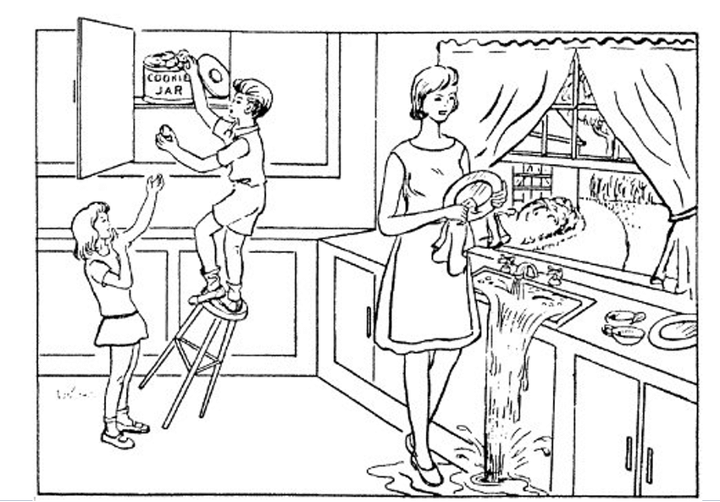
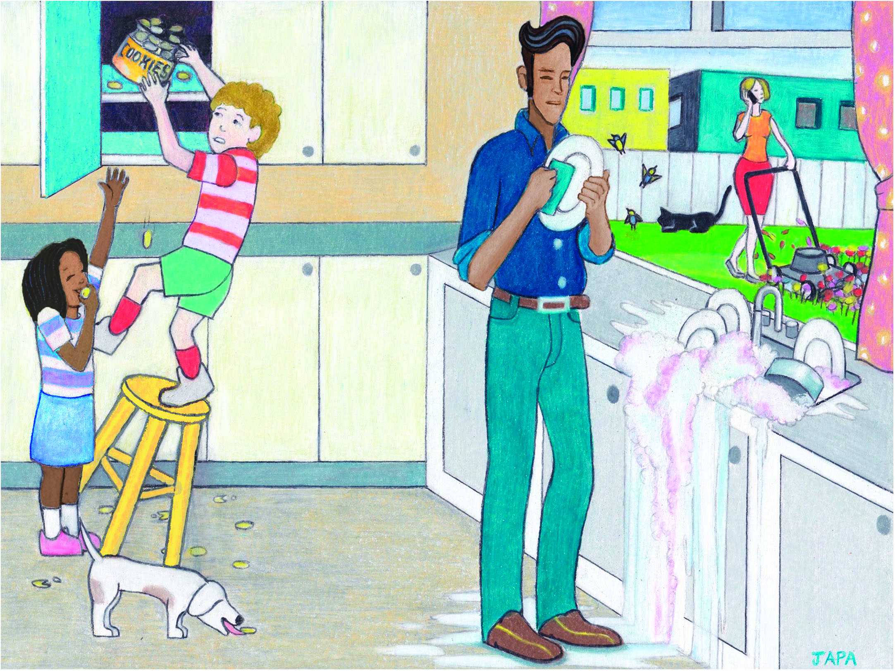

    
     
    Voice as a Biomarker of Health

[mic]: https://custom-icon-badges.demolab.com/badge/Press_to_Record-purple.svg?logo=mic&logoSource=feather
[recording_1]: https://img.shields.io/badge/Recording%201-white
[picture_descriptions]: https://custom-icon-badges.demolab.com/badge/Picture_Description_1_|_Picture_Description_2-darkgreen.svg?logo=image&logoSource=feather
[picture_description_1]:  https://custom-icon-badges.demolab.com/badge/Picture_Description_1-darkgreen.svg?logo=image&logoSource=feather
[picture_description_2]:  https://custom-icon-badges.demolab.com/badge/Picture_Description_2-darkgreen.svg?logo=image&logoSource=feather

# Picture Description

![recording_1][recording_1]

This task helps us analyze features in your voice.

![picture_descriptions][picture_descriptions]

![mic][mic]

---

![picture_description_1][picture_description_1]

Tell me everything you see going on in this picture.

---

![picture_description_2][picture_description_2]

Describe everything that is happening in the picture (as though describing it for the blind), trying to use complete sentences.

