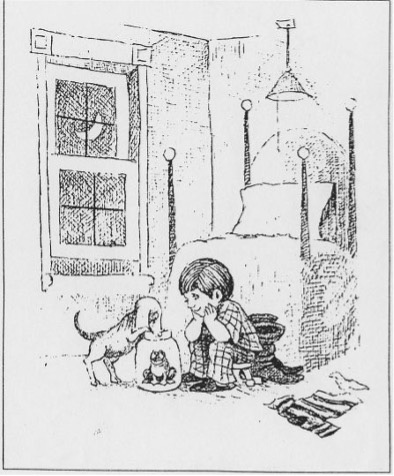
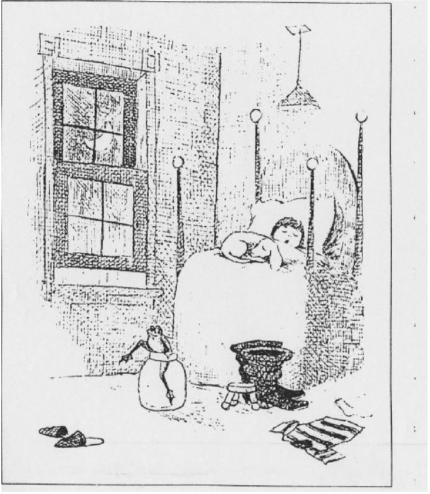
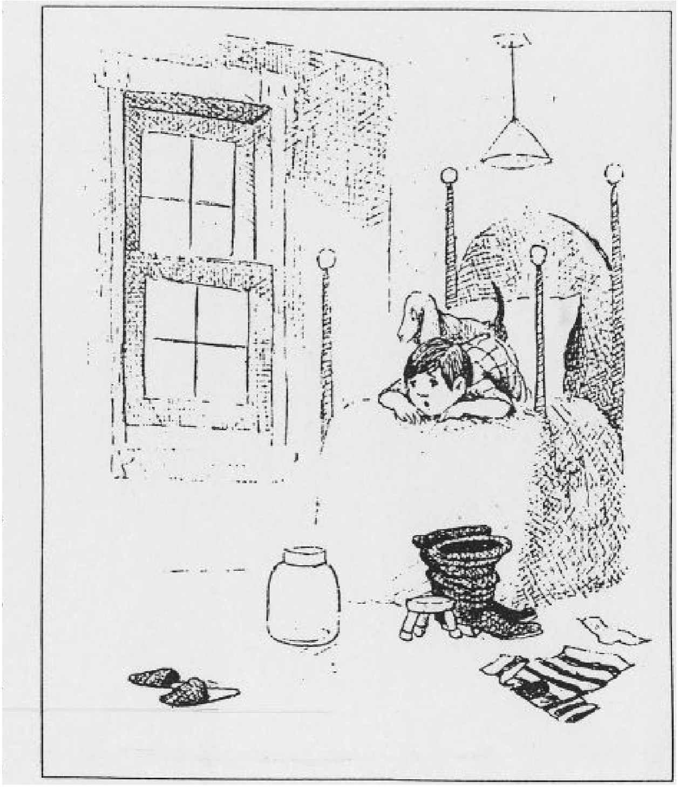
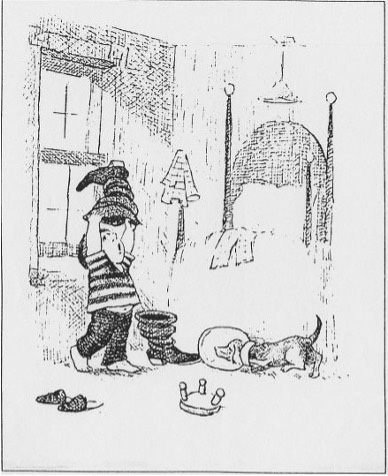
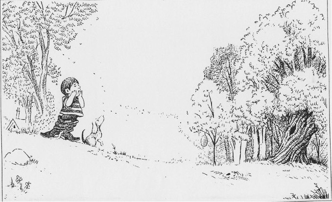
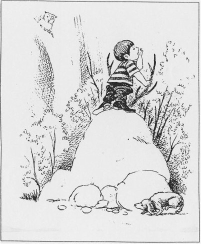
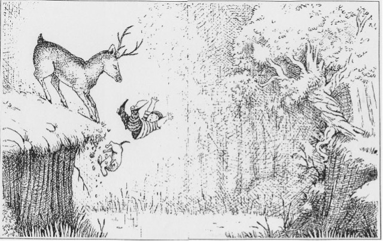
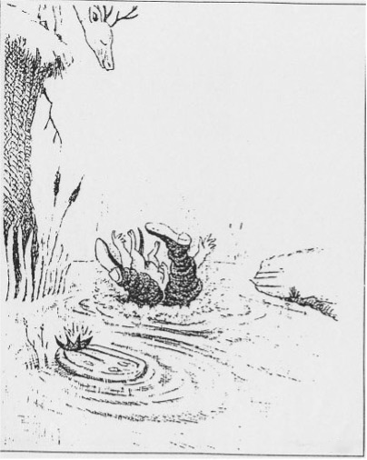
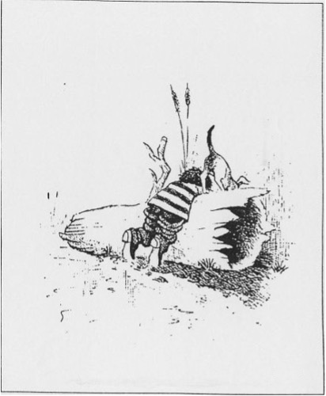
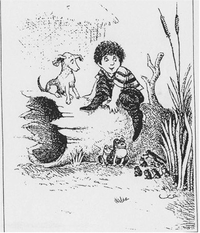

    
     
    Voice as a Biomarker of Health

[recording_1]: https://img.shields.io/badge/Recording%201-white
[mic]: https://custom-icon-badges.demolab.com/badge/Presione_para_grabar-purple.svg?logo=mic&logoSource=feather
[image_1]: https://custom-icon-badges.demolab.com/badge/Image_1-grey.svg?logo=image&logoSource=feather
[image_2]: https://custom-icon-badges.demolab.com/badge/Image_2-grey.svg?logo=image&logoSource=feather
[image_3]: https://custom-icon-badges.demolab.com/badge/Image_3-grey.svg?logo=image&logoSource=feather
[image_4]: https://custom-icon-badges.demolab.com/badge/Image_4-grey.svg?logo=image&logoSource=feather
[image_5]: https://custom-icon-badges.demolab.com/badge/Image_5-grey.svg?logo=image&logoSource=feather
[image_6]: https://custom-icon-badges.demolab.com/badge/Image_6-grey.svg?logo=image&logoSource=feather
[image_7]: https://custom-icon-badges.demolab.com/badge/Image_7-grey.svg?logo=image&logoSource=feather
[image_8]: https://custom-icon-badges.demolab.com/badge/Image_8-grey.svg?logo=image&logoSource=feather
[image_9]: https://custom-icon-badges.demolab.com/badge/Image_9-grey.svg?logo=image&logoSource=feather
[image_10]: https://custom-icon-badges.demolab.com/badge/Image_10-grey.svg?logo=image&logoSource=feather

# Recuerdo de la historia

![recording_1][recording_1]

A continuación, se le presentará una historia sobre un niño y una rana. Puede hacer clic para avanzar y ver la siguiente imagen de la serie. Si lo desea, puede ir hacia adelante y hacia atrás tantas veces como necesite, hasta sentirse cómodo con la historia.

Tendrá hasta **5 minutos** para ver la historia, aunque no es necesario usar todo ese tiempo.

Cuando el tiempo termine, por favor **cuente la historia con el mayor detalle posible.**

Cuando esté listo, haga clic en el **botón de grabar** que aparece abajo.

**Importante:** Una vez que haga clic en el botón de grabar, la historia desaparecerá.

--- 

1. Había un niño quien tenía un perro y una rana. El tenía la rana en su cuarto en un jarro grande.

 

---

2. Una noche cuando el niño y su perro estaban durmiendo, la rana se escapó del jarro. La rana se salió por una ventana abierta.

---

3. Cuando el niño y el perro se despertaron la siguiente mañana, vieron que el jarro estaba vacío.

---

4. El niño buscó en todas partes a la rana. Aún adentro de sus botas. El perro también buscó a la rana. Cuando el perro trató de mirar dentro del jarro, no podia sacar la cabeza

---

5. El niño y el perro buscaron a la rana afuera de la casa. El niño gritaba: “¿Rana, dónde estás?”

---

6. El niño se subió a una roca y volvió a llamar a su rana. Se sostuvo de unas ramas para no caerse.

---

7. ¡Pero las ramas no eran ramas reales! Eran los cuernos de un venado. El venado levantó al niño con su cabeza. Y el venado empezó a correr con el niño que estaba todavía en su cabeza. El venado se paró de pronto y el niño y el perro se cayeron por el precipicio.

---

8. Había un estanque debajo del precipicio. Aterrizaron en el estanque uno encima del otro.

---

9. Oyeron un sonido que conocían. Se acercaron con cuidado y miraron detrás de un tronco de un árbol.

---

10. Allí encontraron a la rana del niño, junto a una rana madre y otras ranitas. Fin.

---

![mic][mic]
