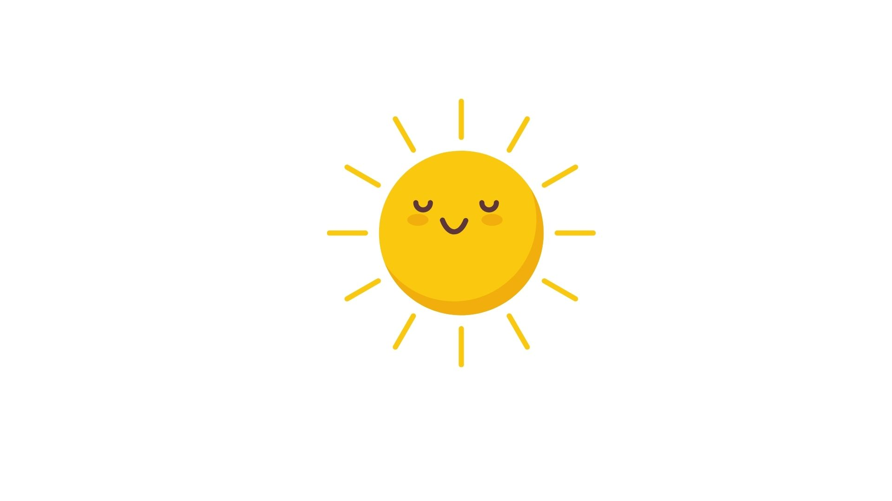
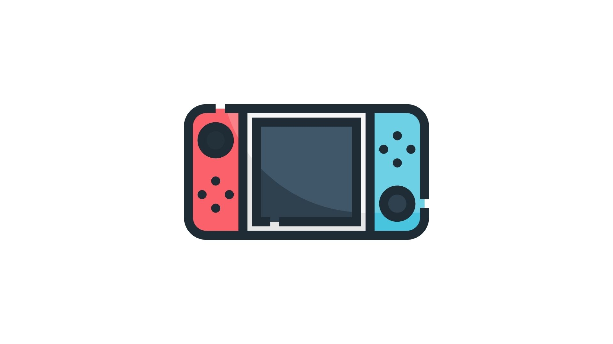
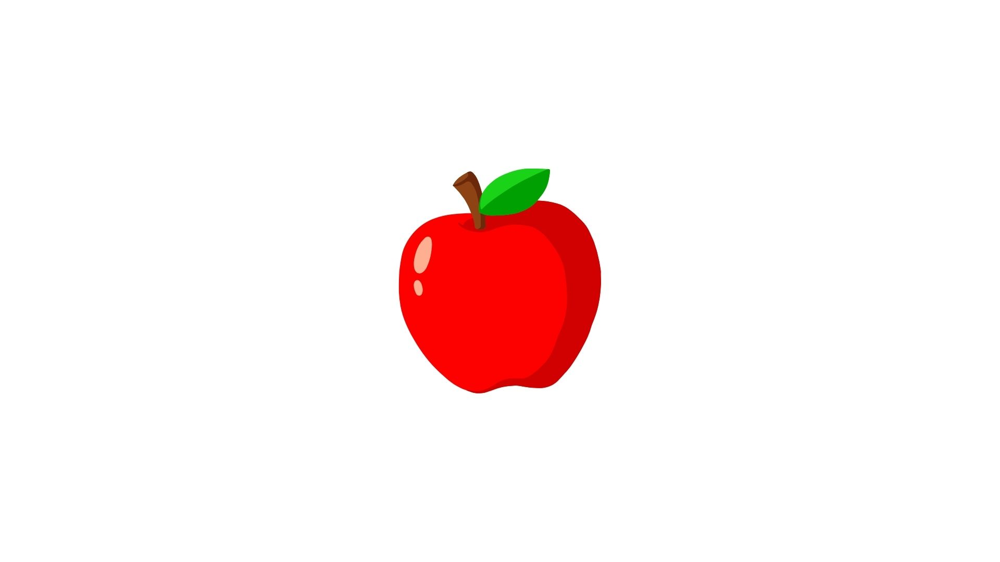
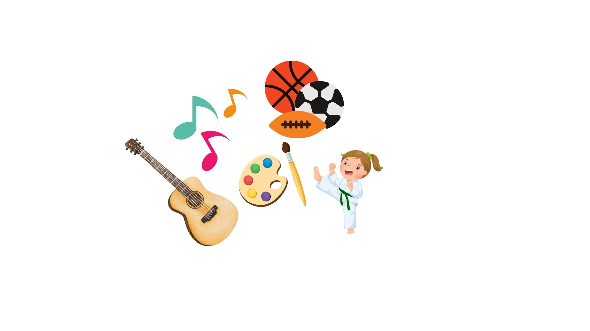

    
     
    Voice as a Biomarker of Health

[mic]: https://custom-icon-badges.demolab.com/badge/Press_to_Record-purple.svg?logo=mic&logoSource=feather
[recording_1]: https://img.shields.io/badge/Recording%201-white
[recording_2]: https://img.shields.io/badge/Recording%202-white
[recording_3]: https://img.shields.io/badge/Recording%203-white
[recording_4]: https://img.shields.io/badge/Recording%204-white

# Conversation (6 plus)

![recording_1][recording_1]

To start, let's learn a little more about you! Tell me about how you get ready for school in the morning.

 

![mic][mic]

---

![recording_2][recording_2]

Do you have a favourite movie? Video game? Show? I'd love to hear about it! When you're ready to share, press "record".

 

![mic][mic]

---

![recording_3][recording_3]

Do you have a favourite food? Or a food you really don't like? When you're ready to share, press "record".

 

![mic][mic]

---

![recording_4][recording_4]

What do you like to do when you're not at school? Tell me about any activities you do like sports, dance, karate, art, etc. When you're ready to share, press "record".

 

![mic][mic]

