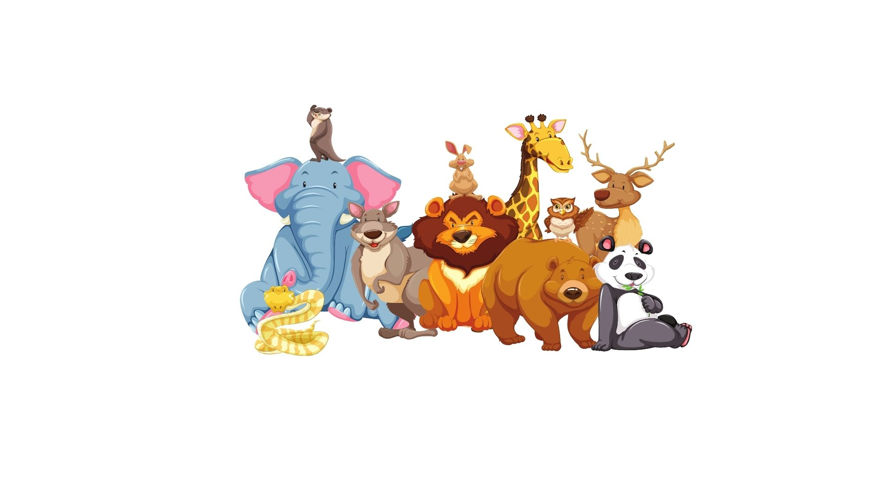
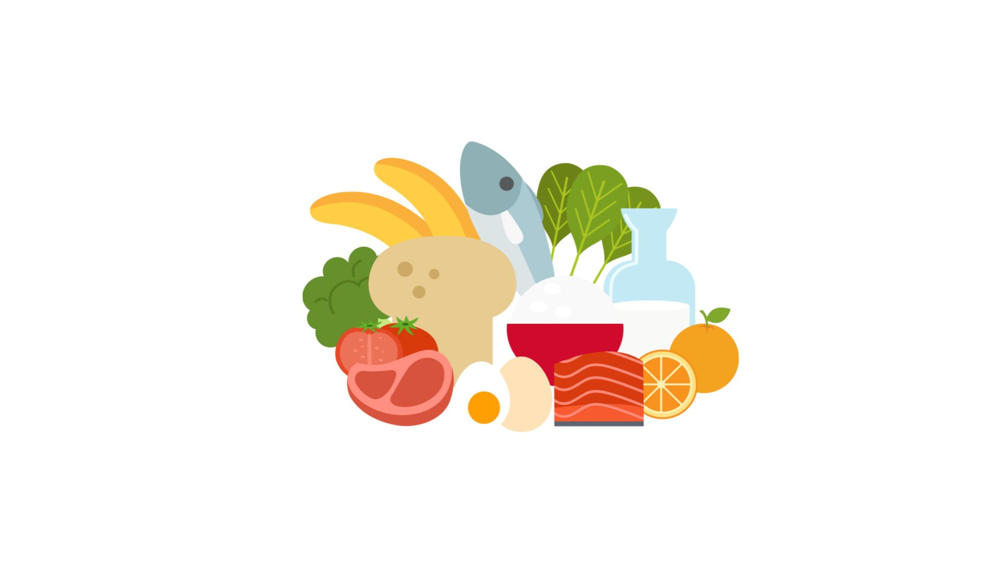

    
     
    Voice as a Biomarker of Health

[mic]: https://custom-icon-badges.demolab.com/badge/Press_to_Record-purple.svg?logo=mic&logoSource=feather
[recording_1]: https://img.shields.io/badge/Recording%201-white
[recording_2]: https://img.shields.io/badge/Recording%202-white

# Generative Naming Task

![recording_1][recording_1]

Thank you for sharing all of that information with me! It's wonderful to get to know you a little better. Next, I'm going to ask you to name lists of things – if you run out of ideas before the recording stops, that's ok!

---
First, I want you to name as many animals you can think of. When you are ready, press "record".

 

![mic][mic]

---

![recording_2][recording_2]

Thank you for sharing all of that information with me! It's wonderful to get to know you a little better. Next, I'm going to ask you to name lists of things – if you run out of ideas before the recording stops, that's ok!

---

Next I want you to name as many food items you can think of. When you are ready, press "record".

 

![mic][mic]

---

