

    
     
    Voice as a Biomarker of Health

[mic]: https://custom-icon-badges.demolab.com/badge/Press_to_Record-purple.svg?logo=mic&logoSource=feather
[recording_1]: https://custom-icon-badges.demolab.com/badge/Recording%201-Identifying%20Pictures--1-8A2BE2.svg?logo=b2ai_voice&logoColor=white
[recording_2]: https://custom-icon-badges.demolab.com/badge/Recording%202-Identifying%20Pictures--2-8A2BE2.svg?logo=b2ai_voice&logoColor=white
[recording_3]: https://custom-icon-badges.demolab.com/badge/Recording%203-Identifying%20Pictures--3-8A2BE2.svg?logo=b2ai_voice&logoColor=white
[recording_4]: https://custom-icon-badges.demolab.com/badge/Recording%204-Identifying%20Pictures--4-8A2BE2.svg?logo=b2ai_voice&logoColor=white
[recording_5]: https://custom-icon-badges.demolab.com/badge/Recording%205-Identifying%20Pictures--5-8A2BE2.svg?logo=b2ai_voice&logoColor=white
[recording_6]: https://custom-icon-badges.demolab.com/badge/Recording%206-Identifying%20Pictures--6-8A2BE2.svg?logo=b2ai_voice&logoColor=white
[recording_7]: https://custom-icon-badges.demolab.com/badge/Recording%207-Identifying%20Pictures--7-8A2BE2.svg?logo=b2ai_voice&logoColor=white
[recording_8]: https://custom-icon-badges.demolab.com/badge/Recording%208-Identifying%20Pictures--8-8A2BE2.svg?logo=b2ai_voice&logoColor=white
[recording_9]: https://custom-icon-badges.demolab.com/badge/Recording%209-Identifying%20Pictures--9-8A2BE2.svg?logo=b2ai_voice&logoColor=white
[recording_10]: https://custom-icon-badges.demolab.com/badge/Recording%2010-Identifying%20Pictures--10-8A2BE2.svg?logo=b2ai_voice&logoColor=white
[recording_11]: https://custom-icon-badges.demolab.com/badge/Recording%2011-Identifying%20Pictures--11-8A2BE2.svg?logo=b2ai_voice&logoColor=white
[recording_12]: https://custom-icon-badges.demolab.com/badge/Recording%2012-Identifying%20Pictures--12-8A2BE2.svg?logo=b2ai_voice&logoColor=white
[recording_13]: https://custom-icon-badges.demolab.com/badge/Recording%2013-Identifying%20Pictures--13-8A2BE2.svg?logo=b2ai_voice&logoColor=white
[recording_14]: https://custom-icon-badges.demolab.com/badge/Recording%2014-Identifying%20Pictures--14-8A2BE2.svg?logo=b2ai_voice&logoColor=white
[recording_15]: https://custom-icon-badges.demolab.com/badge/Recording%2015-Identifying%20Pictures--15-8A2BE2.svg?logo=b2ai_voice&logoColor=white
[recording_16]: https://custom-icon-badges.demolab.com/badge/Recording%2016-Identifying%20Pictures--16-8A2BE2.svg?logo=b2ai_voice&logoColor=white
[recording_17]: https://custom-icon-badges.demolab.com/badge/Recording%2017-Identifying%20Pictures--17-8A2BE2.svg?logo=b2ai_voice&logoColor=white
[recording_18]: https://custom-icon-badges.demolab.com/badge/Recording%2018-Identifying%20Pictures--18-8A2BE2.svg?logo=b2ai_voice&logoColor=white
[recording_19]: https://custom-icon-badges.demolab.com/badge/Recording%2019-Identifying%20Pictures--19-8A2BE2.svg?logo=b2ai_voice&logoColor=white
[recording_20]: https://custom-icon-badges.demolab.com/badge/Recording%2020-Identifying%20Pictures--20-8A2BE2.svg?logo=b2ai_voice&logoColor=white
[recording_21]: https://custom-icon-badges.demolab.com/badge/Recording%2021-Identifying%20Pictures--21-8A2BE2.svg?logo=b2ai_voice&logoColor=white
[recording_22]: https://custom-icon-badges.demolab.com/badge/Recording%2022-Identifying%20Pictures--22-8A2BE2.svg?logo=b2ai_voice&logoColor=white
[recording_23]: https://custom-icon-badges.demolab.com/badge/Recording%2023-Identifying%20Pictures--23-8A2BE2.svg?logo=b2ai_voice&logoColor=white
[recording_24]: https://custom-icon-badges.demolab.com/badge/Recording%2024-Identifying%20Pictures--24-8A2BE2.svg?logo=b2ai_voice&logoColor=white
[recording_25]: https://custom-icon-badges.demolab.com/badge/Recording%2025-Identifying%20Pictures--25-8A2BE2.svg?logo=b2ai_voice&logoColor=white
[recording_26]: https://custom-icon-badges.demolab.com/badge/Recording%2026-Identifying%20Pictures--26-8A2BE2.svg?logo=b2ai_voice&logoColor=white
[recording_27]: https://custom-icon-badges.demolab.com/badge/Recording%2027-Identifying%20Pictures--27-8A2BE2.svg?logo=b2ai_voice&logoColor=white
[recording_28]: https://custom-icon-badges.demolab.com/badge/Recording%2028-Identifying%20Pictures--28-8A2BE2.svg?logo=b2ai_voice&logoColor=white
[recording_29]: https://custom-icon-badges.demolab.com/badge/Recording%2029-Identifying%20Pictures--29-8A2BE2.svg?logo=b2ai_voice&logoColor=white
[recording_30]: https://custom-icon-badges.demolab.com/badge/Recording%2030-Identifying%20Pictures--30-8A2BE2.svg?logo=b2ai_voice&logoColor=white
[recording_31]: https://custom-icon-badges.demolab.com/badge/Recording%2031-Identifying%20Pictures--31-8A2BE2.svg?logo=b2ai_voice&logoColor=white
[recording_32]: https://custom-icon-badges.demolab.com/badge/Recording%2032-Identifying%20Pictures--32-8A2BE2.svg?logo=b2ai_voice&logoColor=white
[recording_33]: https://custom-icon-badges.demolab.com/badge/Recording%2033-Identifying%20Pictures--33-8A2BE2.svg?logo=b2ai_voice&logoColor=white
[recording_34]: https://custom-icon-badges.demolab.com/badge/Recording%2034-Identifying%20Pictures--34-8A2BE2.svg?logo=b2ai_voice&logoColor=white
[recording_35]: https://custom-icon-badges.demolab.com/badge/Recording%2035-Identifying%20Pictures--35-8A2BE2.svg?logo=b2ai_voice&logoColor=white
[recording_36]: https://custom-icon-badges.demolab.com/badge/Recording%2036-Identifying%20Pictures--36-8A2BE2.svg?logo=b2ai_voice&logoColor=white
[recording_37]: https://custom-icon-badges.demolab.com/badge/Recording%2037-Identifying%20Pictures--37-8A2BE2.svg?logo=b2ai_voice&logoColor=white

# Repeating Words

![recording_1][recording_1]

That was great! Let's look at a few more pictures – if you know what it is, say it out loud so we can hear you! Remember, this time you're going to tell me the name of the picture, not the sound that it makes. If you’re not sure, you can skip it and move on to the next picture. When you are ready, press "record".

--- 

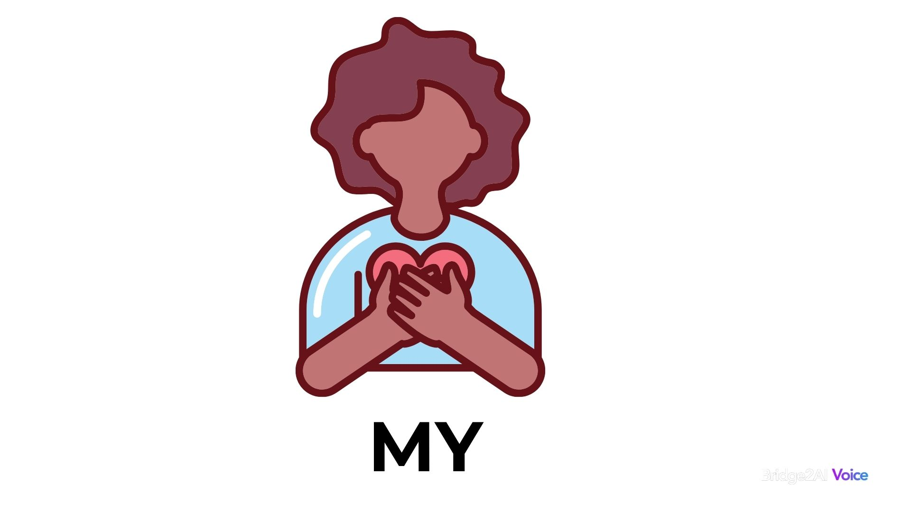 

![mic][mic]

---

![recording_2][recording_2]

That was great! Let's look at a few more pictures – if you know what it is, say it out loud so we can hear you! Remember, this time you're going to tell me the name of the picture, not the sound that it makes. If you’re not sure, you can skip it and move on to the next picture. When you are ready, press "record".

--- 

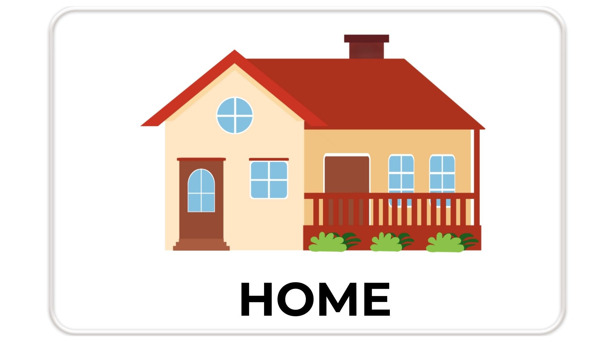 

![mic][mic]

---

![recording_3][recording_3]

That was great! Let's look at a few more pictures – if you know what it is, say it out loud so we can hear you! Remember, this time you're going to tell me the name of the picture, not the sound that it makes. If you’re not sure, you can skip it and move on to the next picture. When you are ready, press "record".

--- 

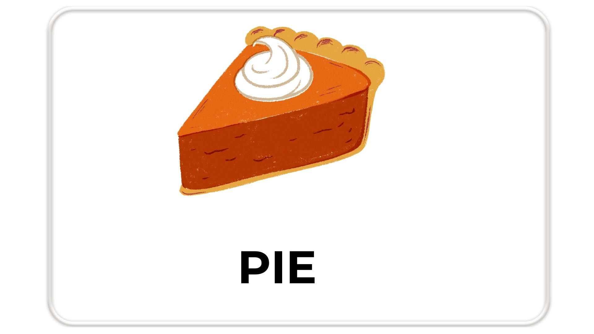 

![mic][mic]

---

![recording_4][recording_4]

That was great! Let's look at a few more pictures – if you know what it is, say it out loud so we can hear you! Remember, this time you're going to tell me the name of the picture, not the sound that it makes. If you’re not sure, you can skip it and move on to the next picture. When you are ready, press "record".

--- 

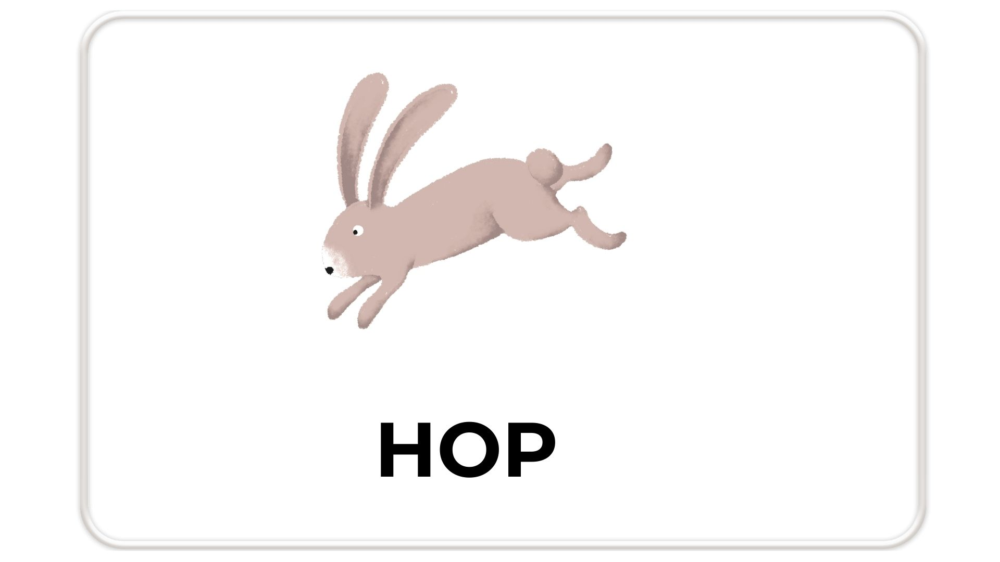 

![mic][mic]

---

![recording_5][recording_5]

That was great! Let's look at a few more pictures – if you know what it is, say it out loud so we can hear you! Remember, this time you're going to tell me the name of the picture, not the sound that it makes. If you’re not sure, you can skip it and move on to the next picture. When you are ready, press "record".

--- 

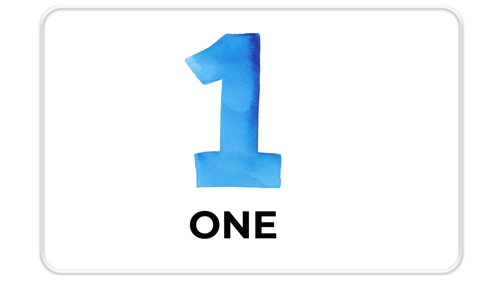 

![mic][mic]

---

![recording_6][recording_6]

That was great! Let's look at a few more pictures – if you know what it is, say it out loud so we can hear you! Remember, this time you're going to tell me the name of the picture, not the sound that it makes. If you’re not sure, you can skip it and move on to the next picture. When you are ready, press "record".

--- 

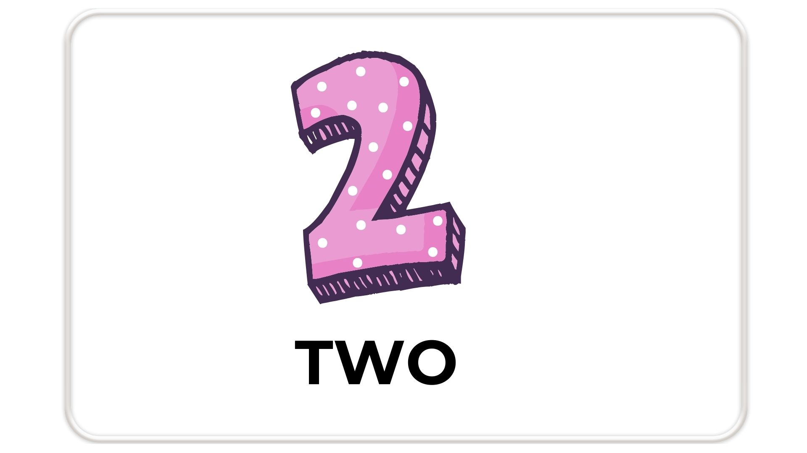 

![mic][mic]

---

![recording_7][recording_7]

That was great! Let's look at a few more pictures – if you know what it is, say it out loud so we can hear you! Remember, this time you're going to tell me the name of the picture, not the sound that it makes. If you’re not sure, you can skip it and move on to the next picture. When you are ready, press "record".

--- 

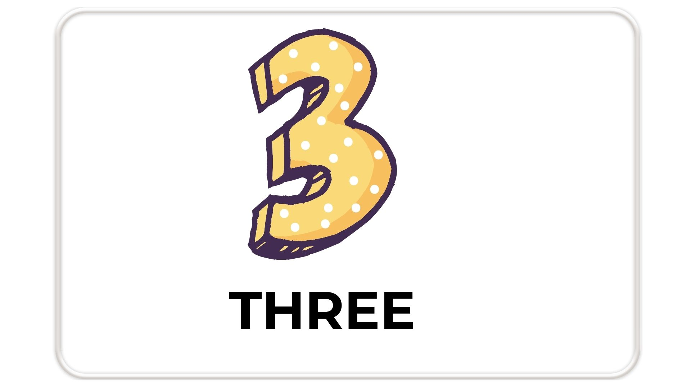 

![mic][mic]

---

![recording_8][recording_8]

That was great! Let's look at a few more pictures – if you know what it is, say it out loud so we can hear you! Remember, this time you're going to tell me the name of the picture, not the sound that it makes. If you’re not sure, you can skip it and move on to the next picture. When you are ready, press "record".

--- 

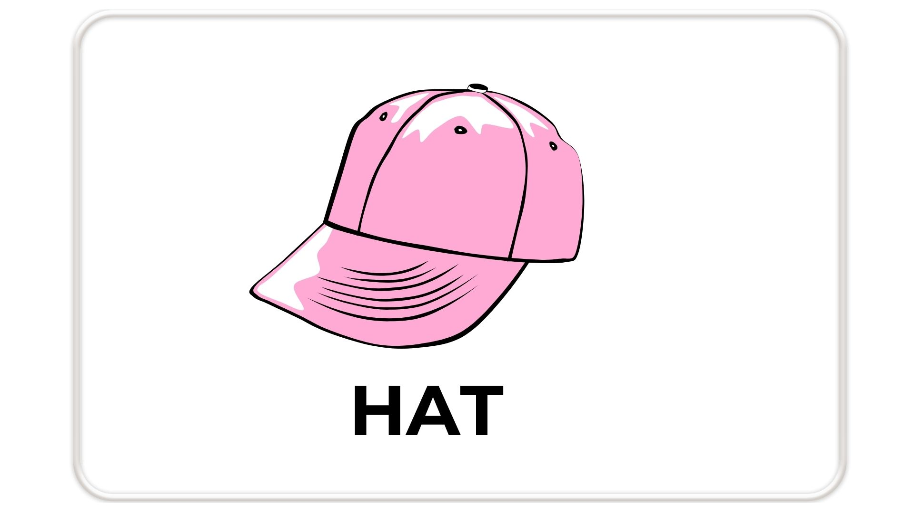 

![mic][mic]

---

![recording_9][recording_9]

That was great! Let's look at a few more pictures – if you know what it is, say it out loud so we can hear you! Remember, this time you're going to tell me the name of the picture, not the sound that it makes. If you’re not sure, you can skip it and move on to the next picture. When you are ready, press "record".

--- 

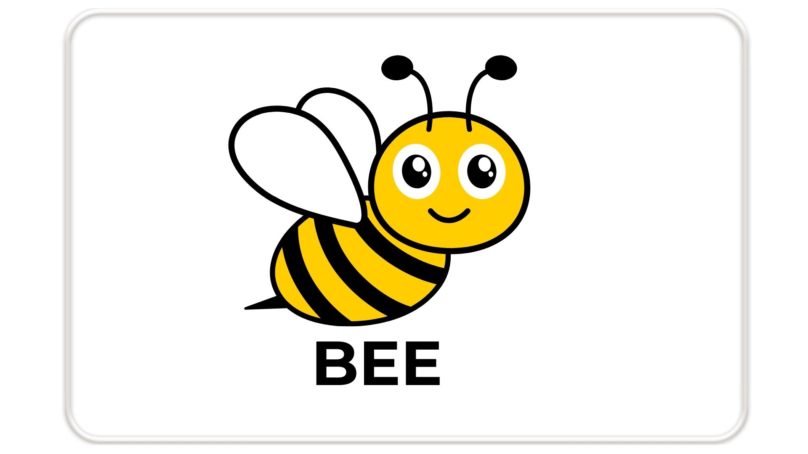 

![mic][mic]

---

![recording_10][recording_10]

That was great! Let's look at a few more pictures – if you know what it is, say it out loud so we can hear you! Remember, this time you're going to tell me the name of the picture, not the sound that it makes. If you’re not sure, you can skip it and move on to the next picture. When you are ready, press "record".

--- 

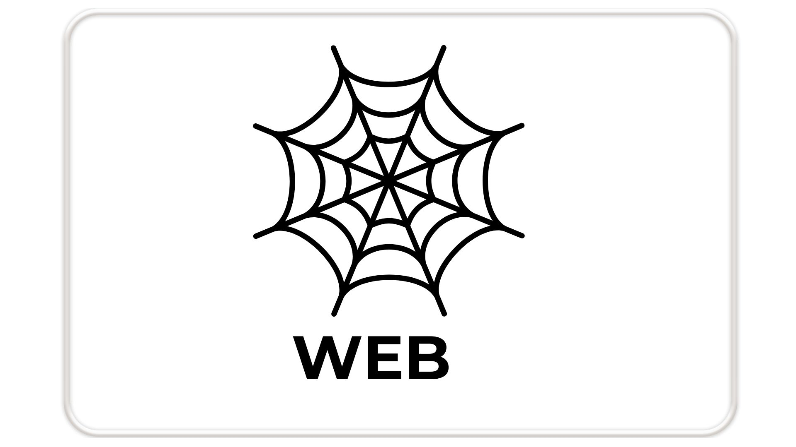 

![mic][mic]

---

![recording_11][recording_11]

That was great! Let's look at a few more pictures – if you know what it is, say it out loud so we can hear you! Remember, this time you're going to tell me the name of the picture, not the sound that it makes. If you’re not sure, you can skip it and move on to the next picture. When you are ready, press "record".

--- 

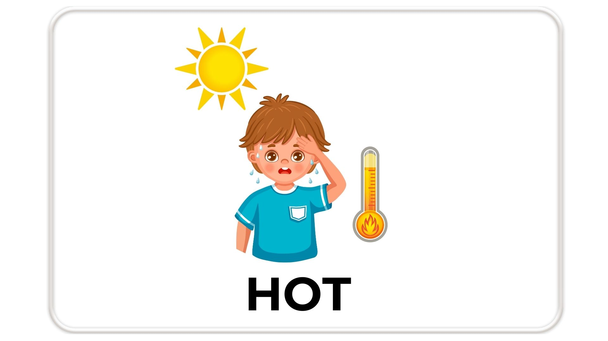 

![mic][mic]

---

![recording_12][recording_12]

That was great! Let's look at a few more pictures – if you know what it is, say it out loud so we can hear you! Remember, this time you're going to tell me the name of the picture, not the sound that it makes. If you’re not sure, you can skip it and move on to the next picture. When you are ready, press "record".

--- 

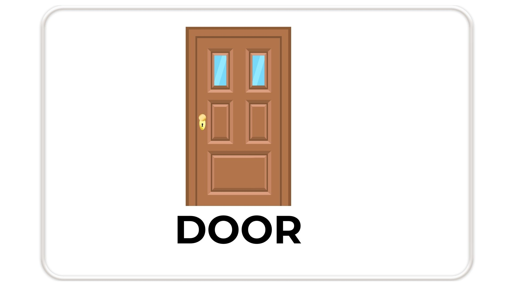 

![mic][mic]

---

![recording_13][recording_13]

That was great! Let's look at a few more pictures – if you know what it is, say it out loud so we can hear you! Remember, this time you're going to tell me the name of the picture, not the sound that it makes. If you’re not sure, you can skip it and move on to the next picture. When you are ready, press "record".

--- 

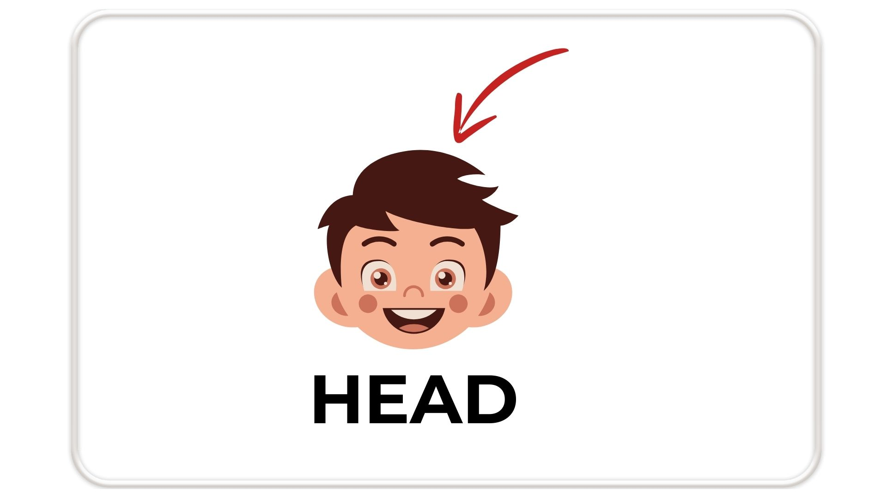 

![mic][mic]

---

![recording_14][recording_14]

That was great! Let's look at a few more pictures – if you know what it is, say it out loud so we can hear you! Remember, this time you're going to tell me the name of the picture, not the sound that it makes. If you’re not sure, you can skip it and move on to the next picture. When you are ready, press "record".

--- 

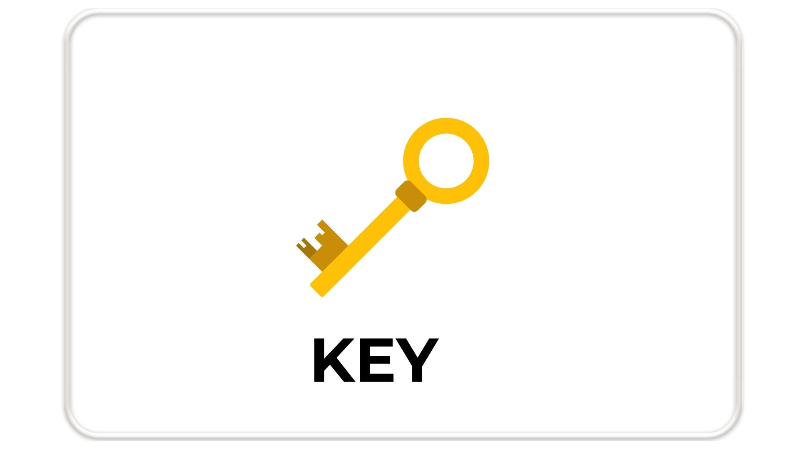 

![mic][mic]

---

![recording_15][recording_15]

That was great! Let's look at a few more pictures – if you know what it is, say it out loud so we can hear you! Remember, this time you're going to tell me the name of the picture, not the sound that it makes. If you’re not sure, you can skip it and move on to the next picture. When you are ready, press "record".

--- 

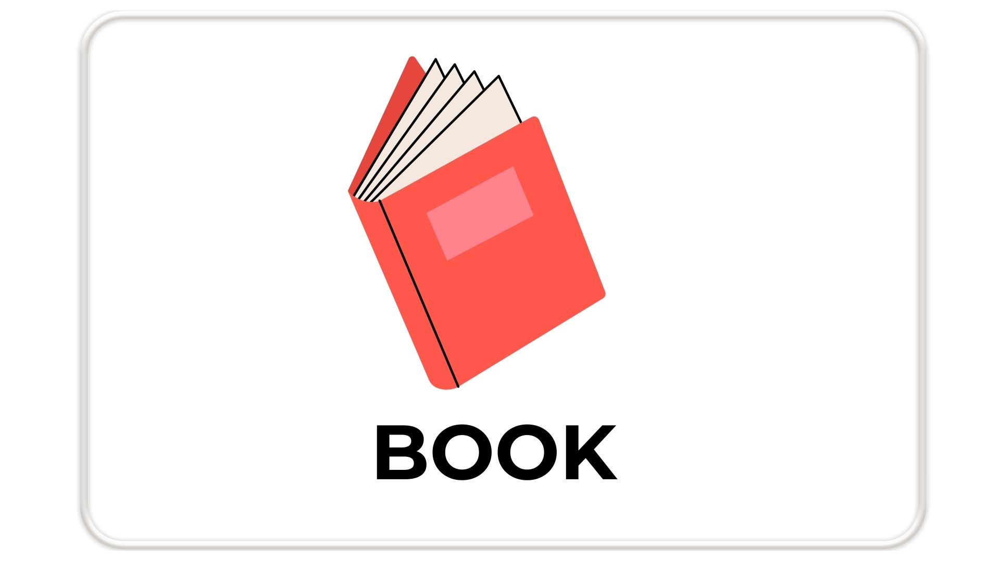 

![mic][mic]

---

![recording_16][recording_16]

That was great! Let's look at a few more pictures – if you know what it is, say it out loud so we can hear you! Remember, this time you're going to tell me the name of the picture, not the sound that it makes. If you’re not sure, you can skip it and move on to the next picture. When you are ready, press "record".

--- 

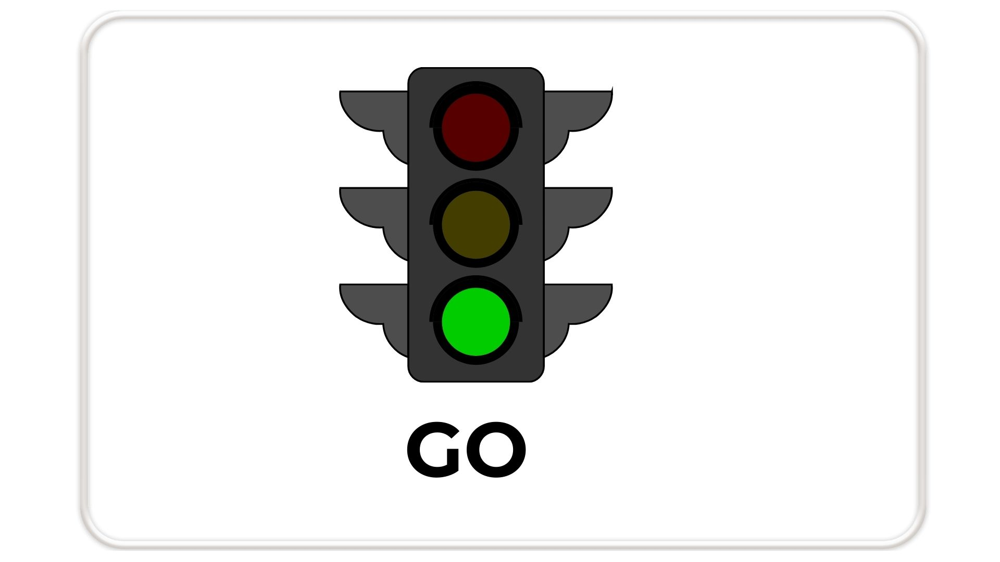 

![mic][mic]

---

![recording_17][recording_17]

That was great! Let's look at a few more pictures – if you know what it is, say it out loud so we can hear you! Remember, this time you're going to tell me the name of the picture, not the sound that it makes. If you’re not sure, you can skip it and move on to the next picture. When you are ready, press "record".

--- 

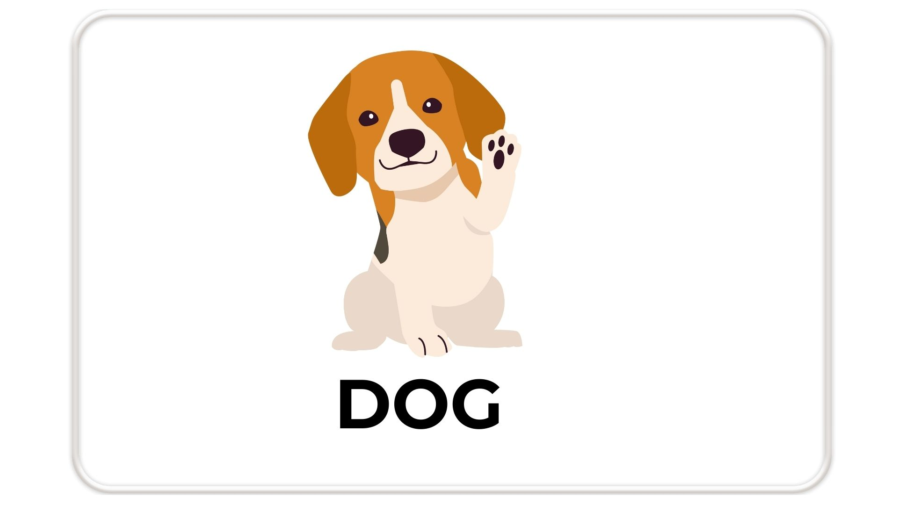 

![mic][mic]

---

![recording_18][recording_18]

That was great! Let's look at a few more pictures – if you know what it is, say it out loud so we can hear you! Remember, this time you're going to tell me the name of the picture, not the sound that it makes. If you’re not sure, you can skip it and move on to the next picture. When you are ready, press "record".

--- 

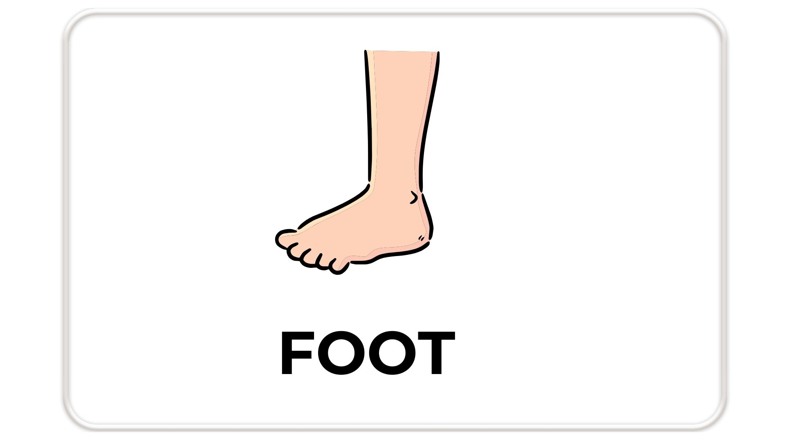 

![mic][mic]

---

![recording_19][recording_19]

That was great! Let's look at a few more pictures – if you know what it is, say it out loud so we can hear you! Remember, this time you're going to tell me the name of the picture, not the sound that it makes. If you’re not sure, you can skip it and move on to the next picture. When you are ready, press "record".

--- 

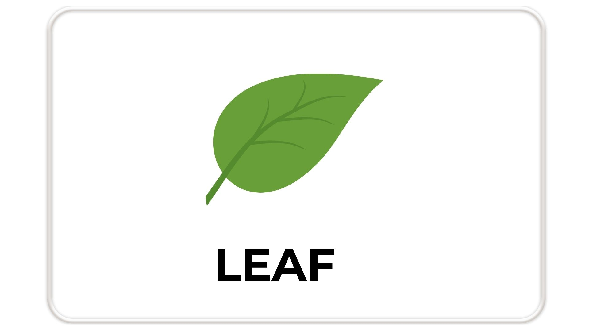 

![mic][mic]

---

![recording_20][recording_20]

That was great! Let's look at a few more pictures – if you know what it is, say it out loud so we can hear you! Remember, this time you're going to tell me the name of the picture, not the sound that it makes. If you’re not sure, you can skip it and move on to the next picture. When you are ready, press "record".

--- 

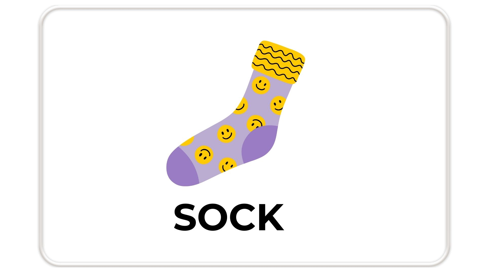 

![mic][mic]

---

![recording_21][recording_21]

That was great! Let's look at a few more pictures – if you know what it is, say it out loud so we can hear you! Remember, this time you're going to tell me the name of the picture, not the sound that it makes. If you’re not sure, you can skip it and move on to the next picture. When you are ready, press "record".

--- 

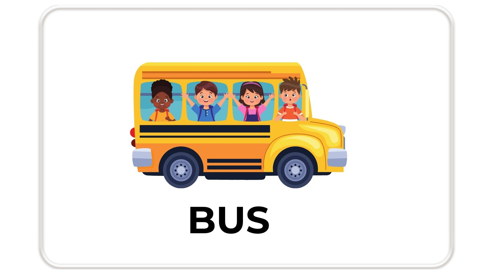 

![mic][mic]

---

![recording_22][recording_22]

That was great! Let's look at a few more pictures – if you know what it is, say it out loud so we can hear you! Remember, this time you're going to tell me the name of the picture, not the sound that it makes. If you’re not sure, you can skip it and move on to the next picture. When you are ready, press "record".

--- 

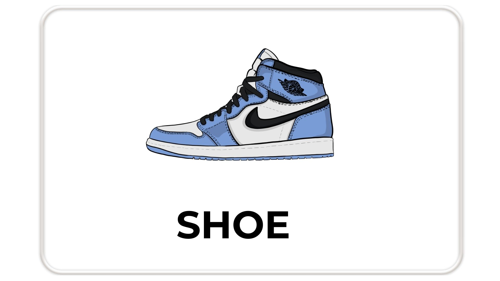 

![mic][mic]

---

![recording_23][recording_23]

That was great! Let's look at a few more pictures – if you know what it is, say it out loud so we can hear you! Remember, this time you're going to tell me the name of the picture, not the sound that it makes. If you’re not sure, you can skip it and move on to the next picture. When you are ready, press "record".

--- 

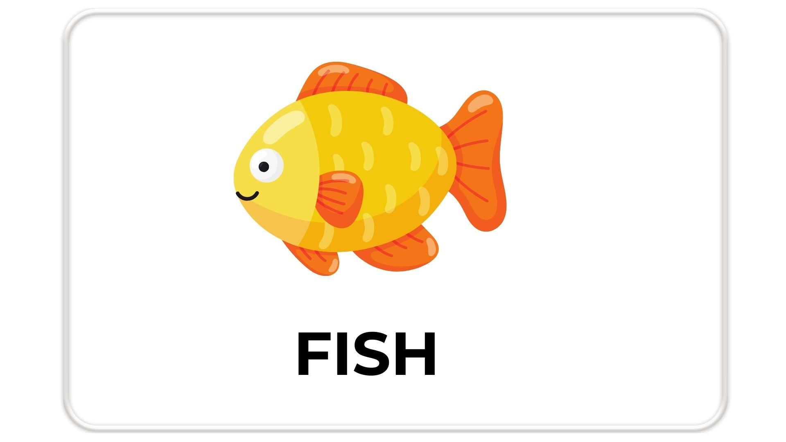 

![mic][mic]

---

![recording_24][recording_24]

That was great! Let's look at a few more pictures – if you know what it is, say it out loud so we can hear you! Remember, this time you're going to tell me the name of the picture, not the sound that it makes. If you’re not sure, you can skip it and move on to the next picture. When you are ready, press "record".

--- 

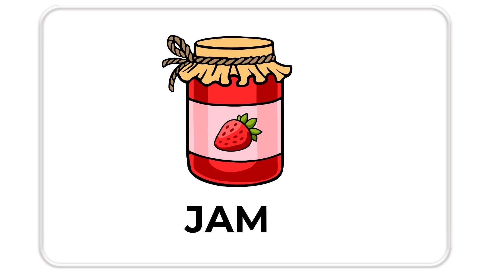 

![mic][mic]

---

![recording_25][recording_25]

That was great! Let's look at a few more pictures – if you know what it is, say it out loud so we can hear you! Remember, this time you're going to tell me the name of the picture, not the sound that it makes. If you’re not sure, you can skip it and move on to the next picture. When you are ready, press "record".

--- 

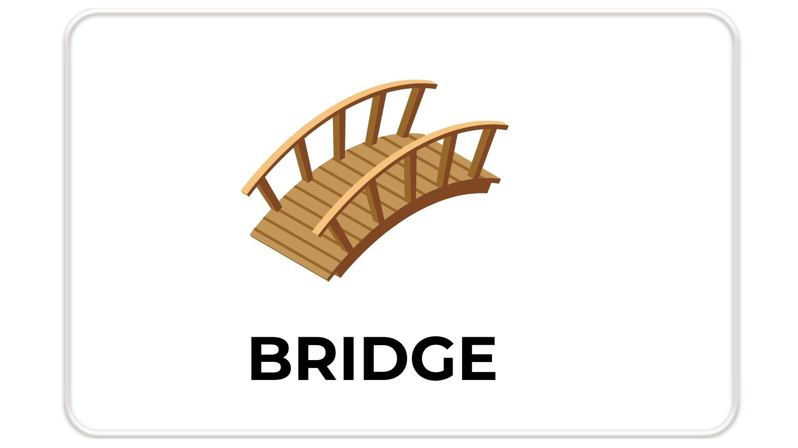 

![mic][mic]

---

![recording_26][recording_26]

That was great! Let's look at a few more pictures – if you know what it is, say it out loud so we can hear you! Remember, this time you're going to tell me the name of the picture, not the sound that it makes. If you’re not sure, you can skip it and move on to the next picture. When you are ready, press "record".

--- 

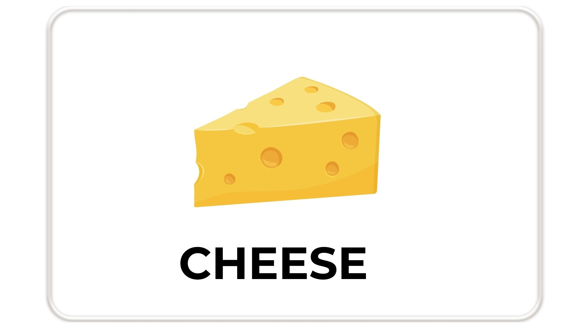 

![mic][mic]

---

![recording_27][recording_27]

That was great! Let's look at a few more pictures – if you know what it is, say it out loud so we can hear you! Remember, this time you're going to tell me the name of the picture, not the sound that it makes. If you’re not sure, you can skip it and move on to the next picture. When you are ready, press "record".

--- 

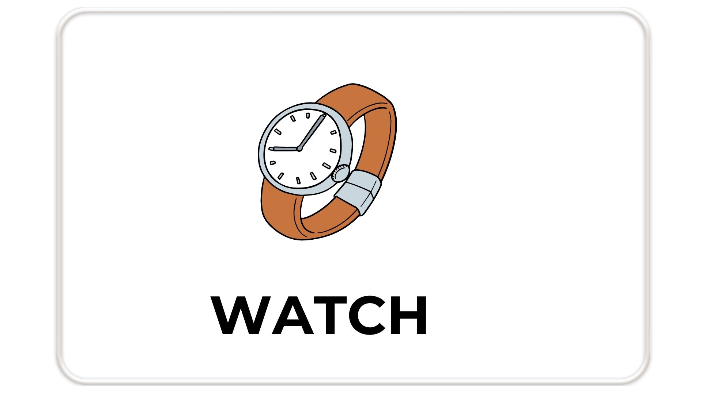 

![mic][mic]

---

![recording_28][recording_28]

That was great! Let's look at a few more pictures – if you know what it is, say it out loud so we can hear you! Remember, this time you're going to tell me the name of the picture, not the sound that it makes. If you’re not sure, you can skip it and move on to the next picture. When you are ready, press "record".

--- 

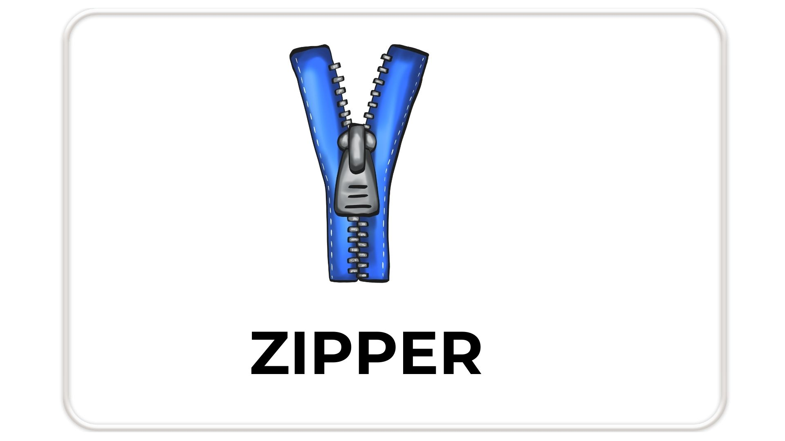 

![mic][mic]

---

![recording_29][recording_29]

That was great! Let's look at a few more pictures – if you know what it is, say it out loud so we can hear you! Remember, this time you're going to tell me the name of the picture, not the sound that it makes. If you’re not sure, you can skip it and move on to the next picture. When you are ready, press "record".

--- 

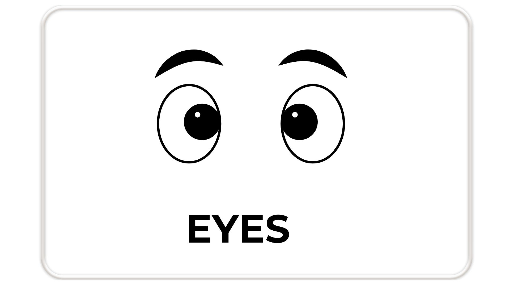 

![mic][mic]

---

![recording_30][recording_30]

That was great! Let's look at a few more pictures – if you know what it is, say it out loud so we can hear you! Remember, this time you're going to tell me the name of the picture, not the sound that it makes. If you’re not sure, you can skip it and move on to the next picture. When you are ready, press "record".

--- 

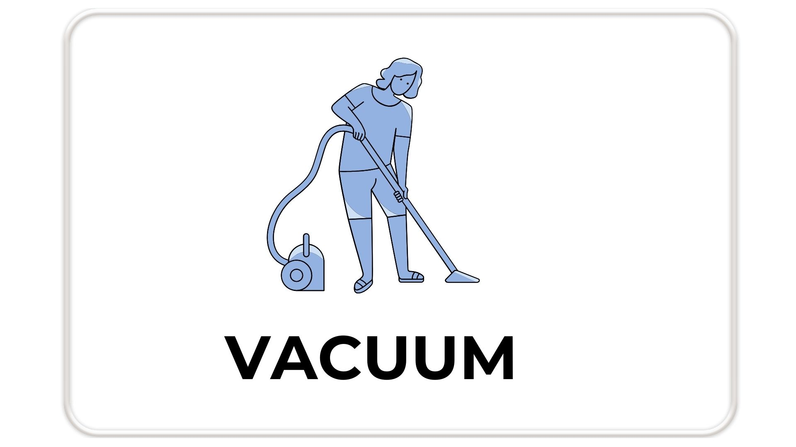 

![mic][mic]

---

![recording_31][recording_31]

That was great! Let's look at a few more pictures – if you know what it is, say it out loud so we can hear you! Remember, this time you're going to tell me the name of the picture, not the sound that it makes. If you’re not sure, you can skip it and move on to the next picture. When you are ready, press "record".

--- 

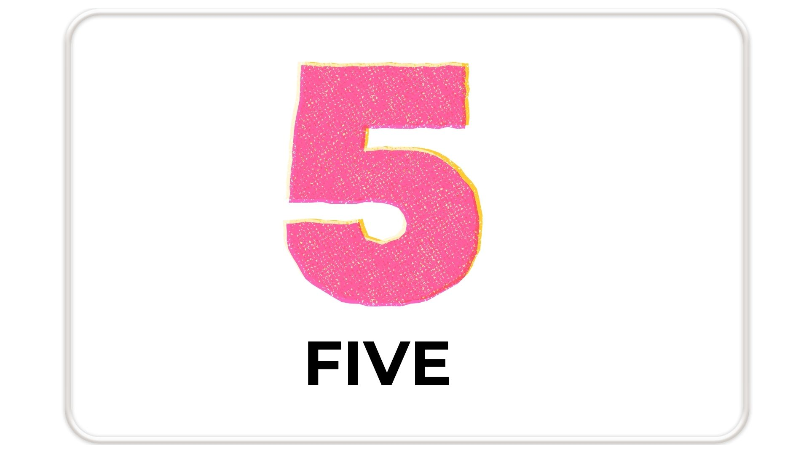 

![mic][mic]

---

![recording_32][recording_32]

That was great! Let's look at a few more pictures – if you know what it is, say it out loud so we can hear you! Remember, this time you're going to tell me the name of the picture, not the sound that it makes. If you’re not sure, you can skip it and move on to the next picture. When you are ready, press "record".

--- 

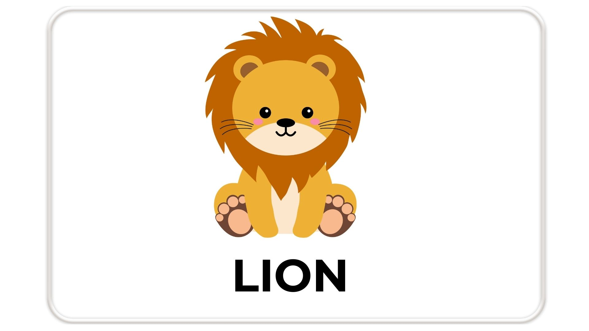 

![mic][mic]

---

![recording_33][recording_33]

That was great! Let's look at a few more pictures – if you know what it is, say it out loud so we can hear you! Remember, this time you're going to tell me the name of the picture, not the sound that it makes. If you’re not sure, you can skip it and move on to the next picture. When you are ready, press "record".

--- 

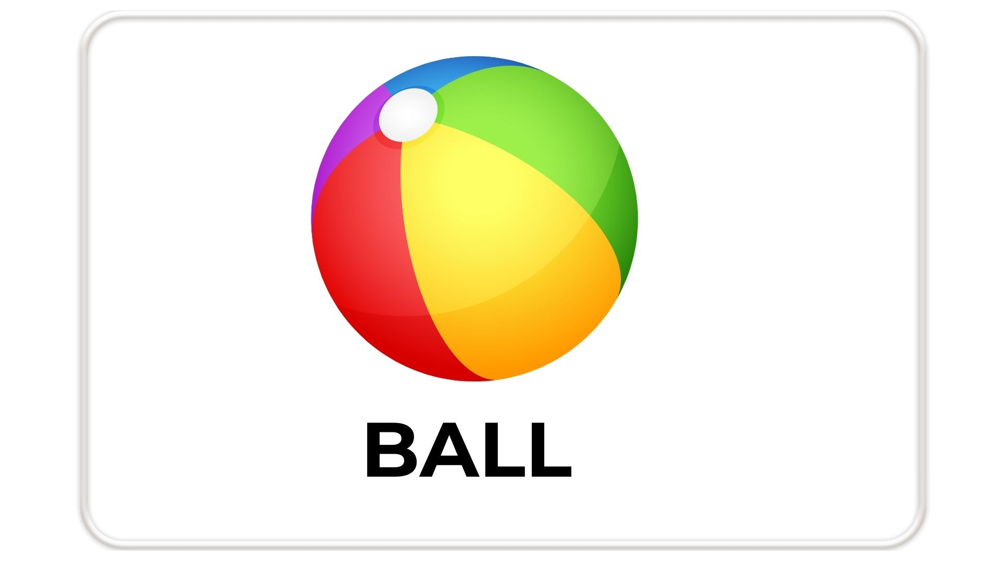 

![mic][mic]

---

![recording_34][recording_34]

That was great! Let's look at a few more pictures – if you know what it is, say it out loud so we can hear you! Remember, this time you're going to tell me the name of the picture, not the sound that it makes. If you’re not sure, you can skip it and move on to the next picture. When you are ready, press "record".

--- 

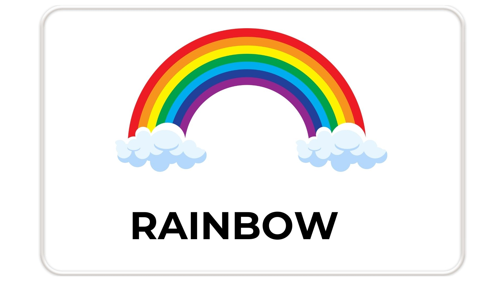 

![mic][mic]

---

![recording_35][recording_35]

That was great! Let's look at a few more pictures – if you know what it is, say it out loud so we can hear you! Remember, this time you're going to tell me the name of the picture, not the sound that it makes. If you’re not sure, you can skip it and move on to the next picture. When you are ready, press "record".

--- 

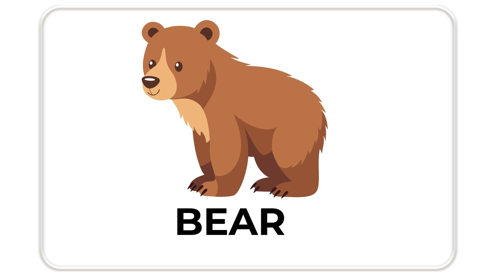 

![mic][mic]

---

![recording_36][recording_36]

That was great! Let's look at a few more pictures – if you know what it is, say it out loud so we can hear you! Remember, this time you're going to tell me the name of the picture, not the sound that it makes. If you’re not sure, you can skip it and move on to the next picture. When you are ready, press "record".

--- 

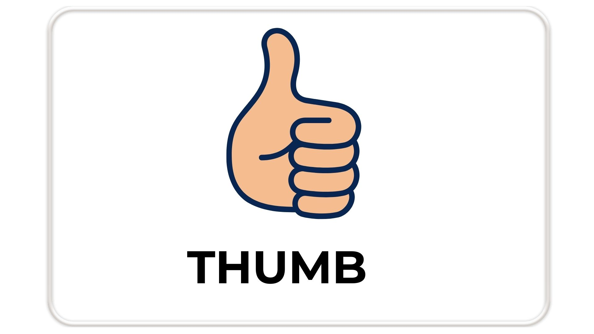 

![mic][mic]

---

![recording_37][recording_37]

That was great! Let's look at a few more pictures – if you know what it is, say it out loud so we can hear you! Remember, this time you're going to tell me the name of the picture, not the sound that it makes. If you’re not sure, you can skip it and move on to the next picture. When you are ready, press "record".

--- 

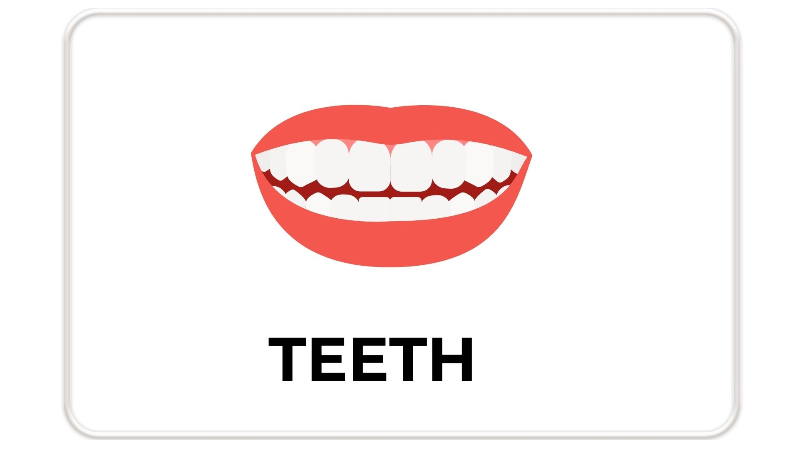 

![mic][mic]

---
