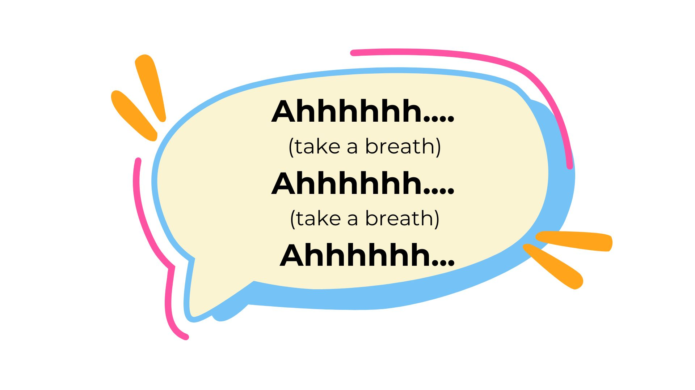
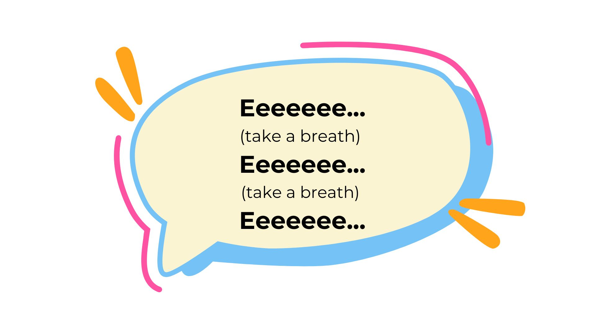

    
     
    Voice as a Biomarker of Health

[mic]: https://custom-icon-badges.demolab.com/badge/Press_to_Record-purple.svg?logo=mic&logoSource=feather
[recording_1]: https://custom-icon-badges.demolab.com/badge/Recording%201-Long%20Sounds--1-8A2BE2.svg?logo=b2ai_voice&logoColor=white
[recording_2]: https://custom-icon-badges.demolab.com/badge/Recording%202-Long%20Sounds--2-8A2BE2.svg?logo=b2ai_voice&logoColor=white

# Long Sounds

![recording_1][recording_1]

---

First, let's start by saying 'ahhhhh' for around 5 seconds. We're going to repeat this three times during one recording. Try to have the child produce the sound at a habitual pitch – some tend to use a higher "note" or create vibrato if they have any singing background The sound produced should be as steady/consistent as possible Re-record if you perceive the child is using a higher pitch when sustaining the vowel (in comparison to speaking) When you are ready, press "record".

 

![mic][mic]

---

![recording_2][recording_2]

---

Next, say the 'eeeeee' sound as steady as you can for about 5 seconds. We'll do this three times as well. When you are ready, press "record".

 

![mic][mic]

---
