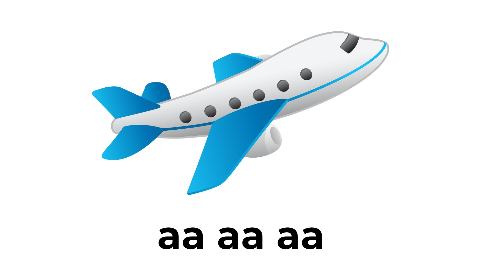
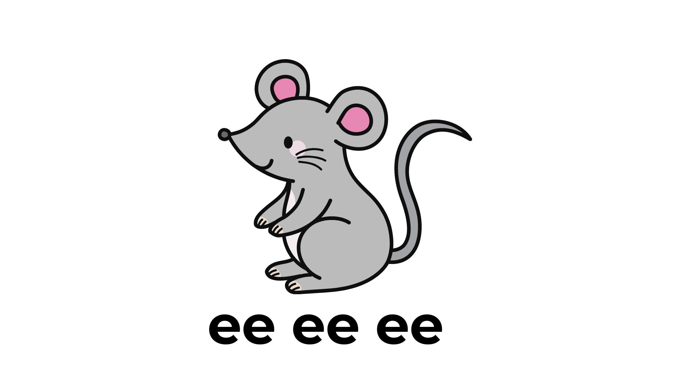
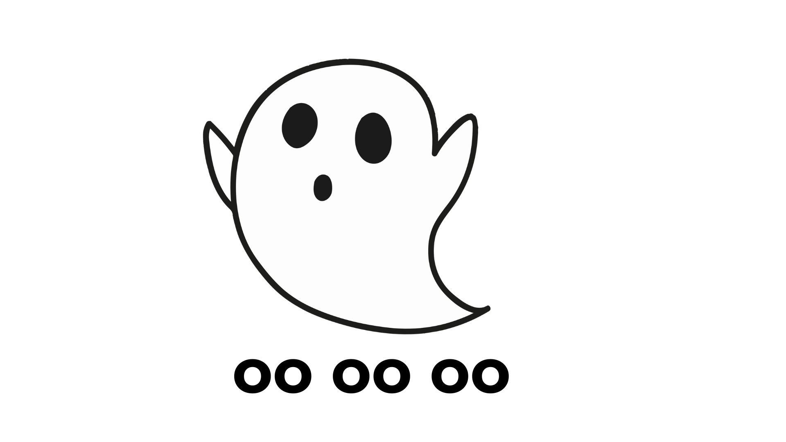
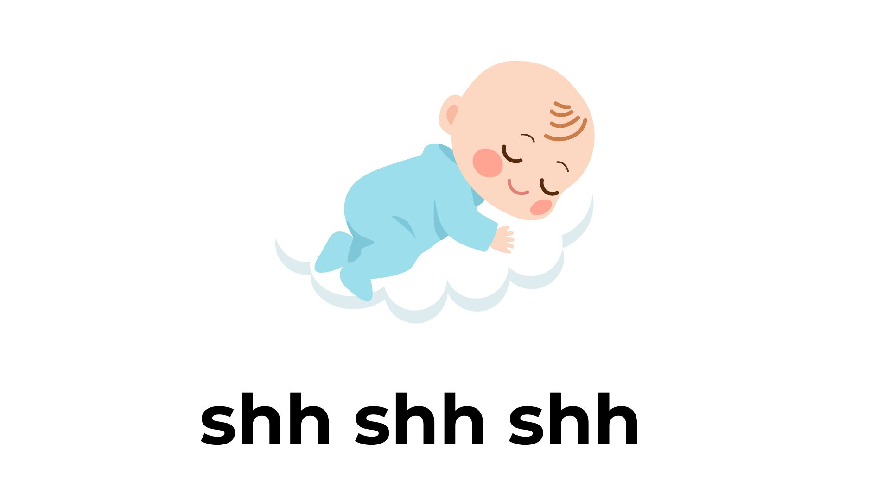
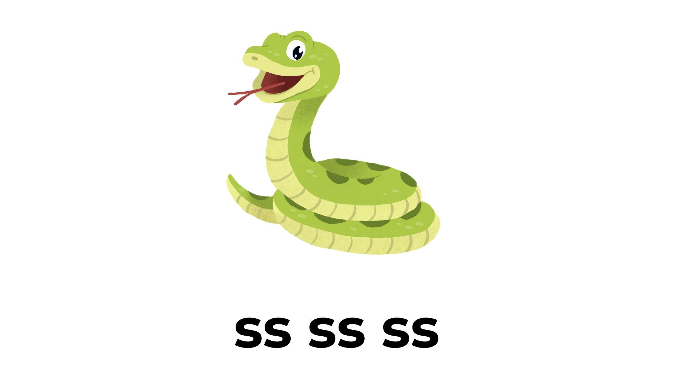
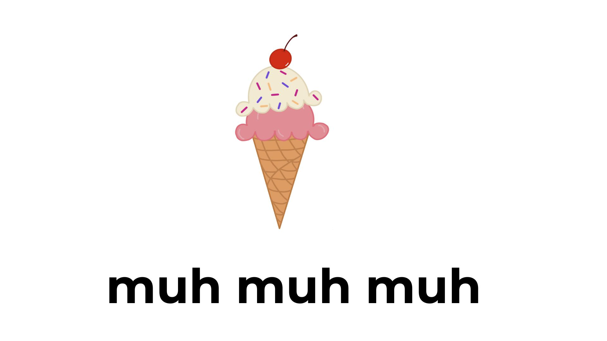
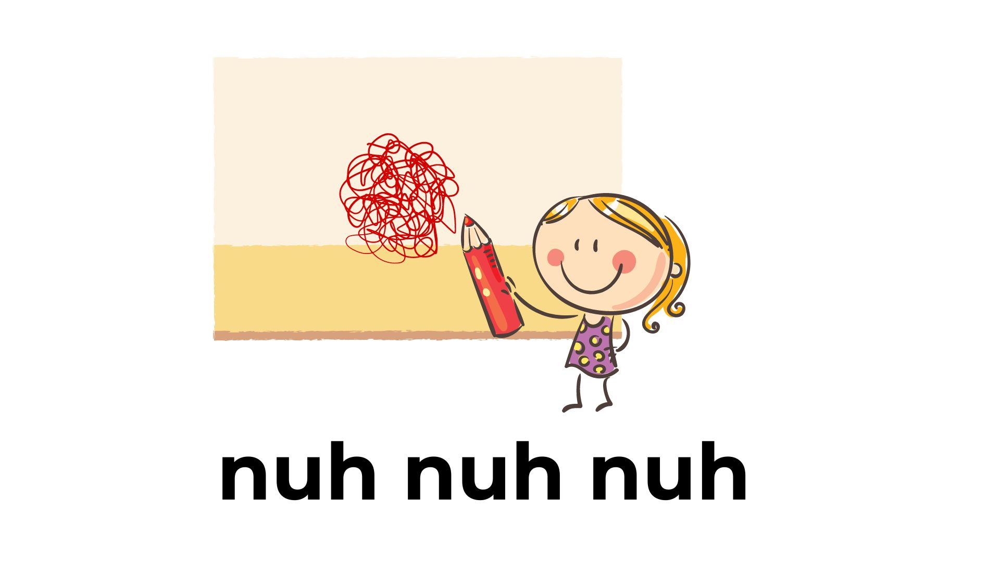
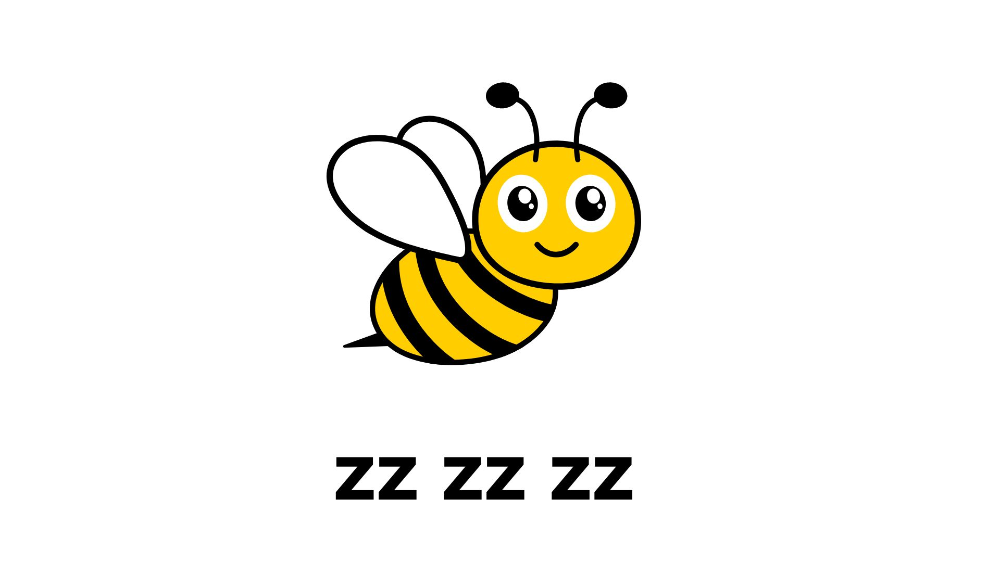
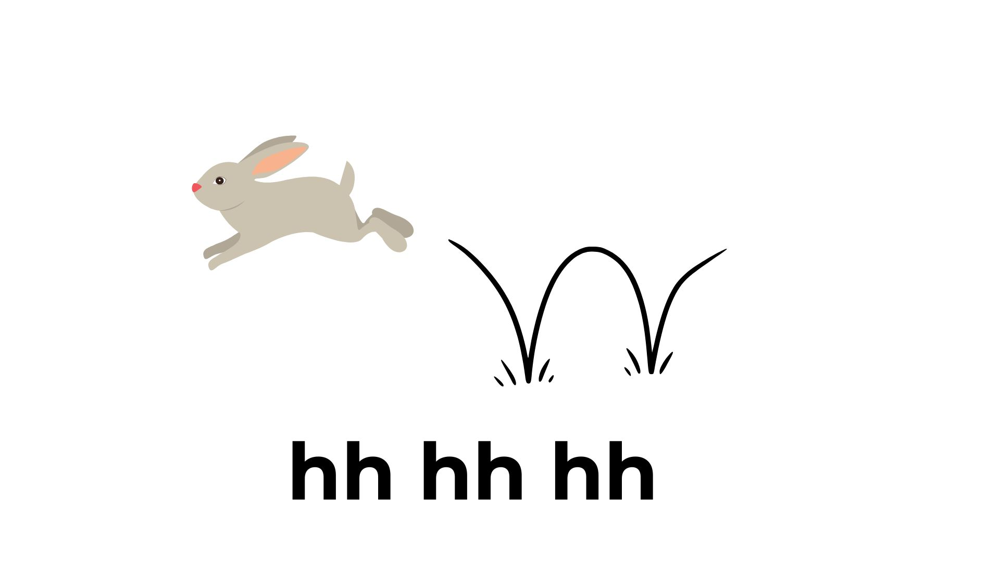
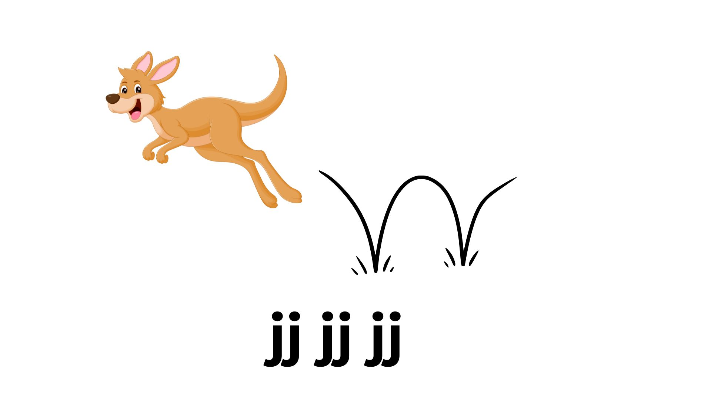

    
     
    Voice as a Biomarker of Health

[mic]: https://custom-icon-badges.demolab.com/badge/Press_to_Record-purple.svg?logo=mic&logoSource=feather
[recording_1]: https://custom-icon-badges.demolab.com/badge/Recording%201-Noisy%20Sounds--1-8A2BE2.svg?logo=b2ai_voice&logoColor=white
[recording_2]: https://custom-icon-badges.demolab.com/badge/Recording%202-Noisy%20Sounds--2-8A2BE2.svg?logo=b2ai_voice&logoColor=white
[recording_3]: https://custom-icon-badges.demolab.com/badge/Recording%203-Noisy%20Sounds--3-8A2BE2.svg?logo=b2ai_voice&logoColor=white
[recording_4]: https://custom-icon-badges.demolab.com/badge/Recording%204-Noisy%20Sounds--4-8A2BE2.svg?logo=b2ai_voice&logoColor=white
[recording_5]: https://custom-icon-badges.demolab.com/badge/Recording%205-Noisy%20Sounds--5-8A2BE2.svg?logo=b2ai_voice&logoColor=white
[recording_6]: https://custom-icon-badges.demolab.com/badge/Recording%206-Noisy%20Sounds--6-8A2BE2.svg?logo=b2ai_voice&logoColor=white
[recording_7]: https://custom-icon-badges.demolab.com/badge/Recording%207-Noisy%20Sounds--7-8A2BE2.svg?logo=b2ai_voice&logoColor=white
[recording_8]: https://custom-icon-badges.demolab.com/badge/Recording%208-Noisy%20Sounds--8-8A2BE2.svg?logo=b2ai_voice&logoColor=white
[recording_9]: https://custom-icon-badges.demolab.com/badge/Recording%209-Noisy%20Sounds--9-8A2BE2.svg?logo=b2ai_voice&logoColor=white
[recording_10]: https://custom-icon-badges.demolab.com/badge/Recording%2010-Noisy%20Sounds--10-8A2BE2.svg?logo=b2ai_voice&logoColor=white

# Noisy Sounds

![recording_1][recording_1]

What a great job! Do you like making silly sounds? Do you know what sound a ghost or a mouse makes? Let's see if we can figure out what sound each of these pictures make.

---

Here's a picture of an airplane – it makes an 'ah' sound – we're going to say that three times – 'ah ah ah' When you are ready, press "record".

 

![mic][mic]

---

![recording_2][recording_2]

What a great job! Do you like making silly sounds? Do you know what sound a ghost or a mouse makes? Let's see if we can figure out what sound each of these pictures make.

---

Next is a little mouse – it makes an 'ee ee ee' sound - your turn! When you are ready, press "record".

 

![mic][mic]

---

![recording_3][recording_3]

What a great job! Do you like making silly sounds? Do you know what sound a ghost or a mouse makes? Let's see if we can figure out what sound each of these pictures make.

---

Here's a little ghost – he says 'oo oo oo' – your turn! When you are ready, press "record".

 

![mic][mic]

---

![recording_4][recording_4]

What a great job! Do you like making silly sounds? Do you know what sound a ghost or a mouse makes? Let's see if we can figure out what sound each of these pictures make.

---

The baby is sleeping, so we say 'sh sh sh'. Now you try! When you are ready, press "record".

 

![mic][mic]

---

![recording_5][recording_5]

What a great job! Do you like making silly sounds? Do you know what sound a ghost or a mouse makes? Let's see if we can figure out what sound each of these pictures make.

---

The snake makes a 'ss ss ss'. Can I hear you make that snake sound? When you are ready, press "record".

 

![mic][mic]

---

![recording_6][recording_6]

What a great job! Do you like making silly sounds? Do you know what sound a ghost or a mouse makes? Let's see if we can figure out what sound each of these pictures make.

---

Eating ice cream you might say "muh muh muh" – your turn! When you are ready, press "record".

 

![mic][mic]

---

![recording_7][recording_7]

What a great job! Do you like making silly sounds? Do you know what sound a ghost or a mouse makes? Let's see if we can figure out what sound each of these pictures make.

---

Uh oh! Looks like the baby has been colouring on the walls. We should tell him to stop – "nuh nuh nuh". You tell him too! When you are ready, press "record".

 

![mic][mic]

---

![recording_8][recording_8]

What a great job! Do you like making silly sounds? Do you know what sound a ghost or a mouse makes? Let's see if we can figure out what sound each of these pictures make.

---

The little bee makes a buzzing noise – 'zz zz zz'. Your turn! When you are ready, press "record".

 

![mic][mic]

---

![recording_9][recording_9]

What a great job! Do you like making silly sounds? Do you know what sound a ghost or a mouse makes? Let's see if we can figure out what sound each of these pictures make.

---

Bunnies hop around – 'hh hh hh' - now you do it! When you are ready, press "record".

 

![mic][mic]

---

![recording_10][recording_10]

What a great job! Do you like making silly sounds? Do you know what sound a ghost or a mouse makes? Let's see if we can figure out what sound each of these pictures make.

---

Have you ever seen a kangaroo jumping around? They go 'jj jj jj' – you try! When you are ready, press "record".

 

![mic][mic]

---
