

    
     
    Voice as a Biomarker of Health

[mic]: https://custom-icon-badges.demolab.com/badge/Press_to_Record-purple.svg?logo=mic&logoSource=feather
[recording_1]: https://custom-icon-badges.demolab.com/badge/Recording%201-Reading%20Passage--1-8A2BE2.svg?logo=b2ai_voice&logoColor=white
[recording_2]: https://custom-icon-badges.demolab.com/badge/Recording%202-Reading%20Passage--2-8A2BE2.svg?logo=b2ai_voice&logoColor=white
[recording_3]: https://custom-icon-badges.demolab.com/badge/Recording%203-Reading%20Passage--3-8A2BE2.svg?logo=b2ai_voice&logoColor=white
[recording_4]: https://custom-icon-badges.demolab.com/badge/Recording%204-Reading%20Passage--4-8A2BE2.svg?logo=b2ai_voice&logoColor=white
[recording_5]: https://custom-icon-badges.demolab.com/badge/Recording%205-Reading%20Passage--5-8A2BE2.svg?logo=b2ai_voice&logoColor=white
[recording_6]: https://custom-icon-badges.demolab.com/badge/Recording%206-Reading%20Passage--6-8A2BE2.svg?logo=b2ai_voice&logoColor=white
[recording_7]: https://custom-icon-badges.demolab.com/badge/Recording%207-Reading%20Passage--7-8A2BE2.svg?logo=b2ai_voice&logoColor=white
[recording_8]: https://custom-icon-badges.demolab.com/badge/Recording%208-Reading%20Passage--8-8A2BE2.svg?logo=b2ai_voice&logoColor=white
[recording_9]: https://custom-icon-badges.demolab.com/badge/Recording%209-Reading%20Passage--9-8A2BE2.svg?logo=b2ai_voice&logoColor=white
[recording_10]: https://custom-icon-badges.demolab.com/badge/Recording%2010-Reading%20Passage--10-8A2BE2.svg?logo=b2ai_voice&logoColor=white
[recording_11]: https://custom-icon-badges.demolab.com/badge/Recording%2011-Reading%20Passage--10-8A2BE2.svg?logo=b2ai_voice&logoColor=white

# Reading Passage

![recording_1][recording_1]

Fantastic Job! We only have one more thing to do today.

Since you did so well reading the sentences earlier, let's try a few more. We're going to read a short story about a roller coaster ride called "The Caterpillar".
A sentence or two will appear on the screen – read it aloud as if you were reading any regular story book. If you're not sure about a word, just skip it and keep going. When you are ready, press "record".

---

Passage 1. When you are ready, press "record".

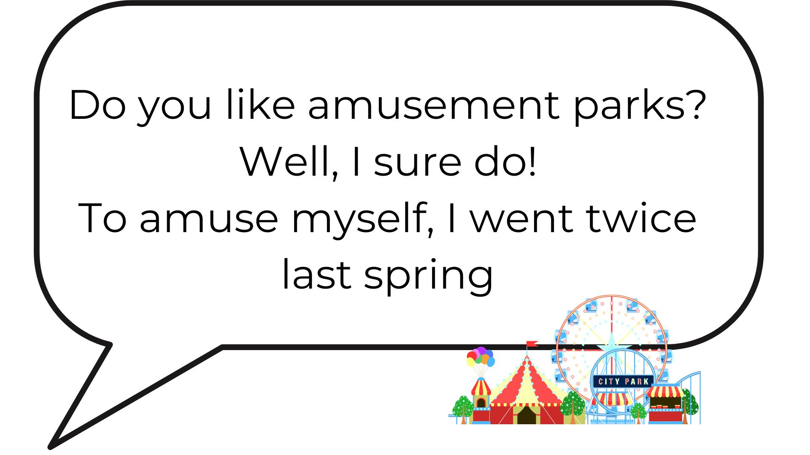 

![mic][mic]

---

![recording_2][recording_2]

Fantastic Job! We only have one more thing to do today.

Since you did so well reading the sentences earlier, let's try a few more. We're going to read a short story about a roller coaster ride called "The Caterpillar".
A sentence or two will appear on the screen – read it aloud as if you were reading any regular story book. If you're not sure about a word, just skip it and keep going. When you are ready, press "record".

---

Passage 2. When you are ready, press "record".

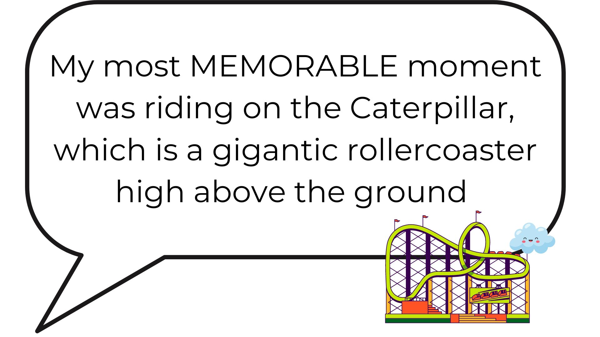 

![mic][mic]

---

![recording_3][recording_3]

Fantastic Job! We only have one more thing to do today.

Since you did so well reading the sentences earlier, let's try a few more. We're going to read a short story about a roller coaster ride called "The Caterpillar".
A sentence or two will appear on the screen – read it aloud as if you were reading any regular story book. If you're not sure about a word, just skip it and keep going. When you are ready, press "record".

---

Passage 3. When you are ready, press "record".

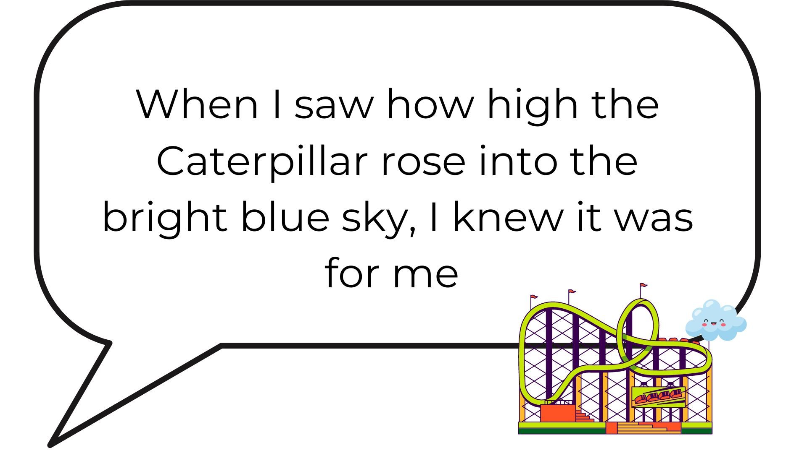 

![mic][mic]

---

![recording_4][recording_4]

Fantastic Job! We only have one more thing to do today.

Since you did so well reading the sentences earlier, let's try a few more. We're going to read a short story about a roller coaster ride called "The Caterpillar".
A sentence or two will appear on the screen – read it aloud as if you were reading any regular story book. If you're not sure about a word, just skip it and keep going. When you are ready, press "record".

---

Passage 4. When you are ready, press "record".

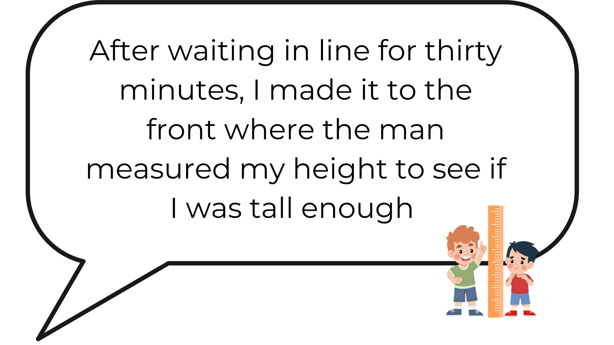 

![mic][mic]

---

![recording_5][recording_5]

Fantastic Job! We only have one more thing to do today.

Since you did so well reading the sentences earlier, let's try a few more. We're going to read a short story about a roller coaster ride called "The Caterpillar".
A sentence or two will appear on the screen – read it aloud as if you were reading any regular story book. If you're not sure about a word, just skip it and keep going. When you are ready, press "record".

---

Passage 5. When you are ready, press "record".

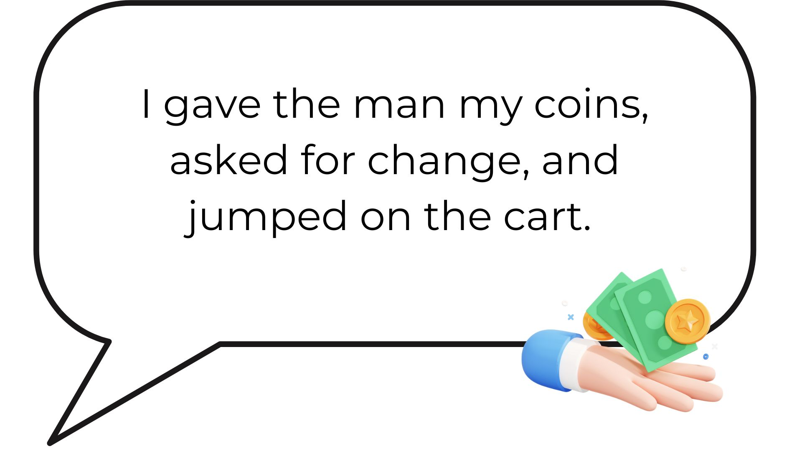 

![mic][mic]

---

![recording_6][recording_6]

Fantastic Job! We only have one more thing to do today.

Since you did so well reading the sentences earlier, let's try a few more. We're going to read a short story about a roller coaster ride called "The Caterpillar".
A sentence or two will appear on the screen – read it aloud as if you were reading any regular story book. If you're not sure about a word, just skip it and keep going. When you are ready, press "record".

---

Passage 6. When you are ready, press "record".

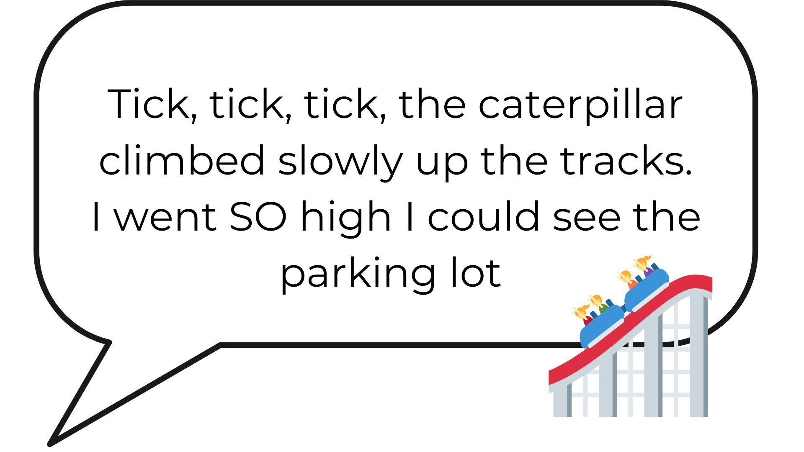 

![mic][mic]

---

![recording_7][recording_7]

Fantastic Job! We only have one more thing to do today.

Since you did so well reading the sentences earlier, let's try a few more. We're going to read a short story about a roller coaster ride called "The Caterpillar".
A sentence or two will appear on the screen – read it aloud as if you were reading any regular story book. If you're not sure about a word, just skip it and keep going. When you are ready, press "record".

---

Passage 7. When you are ready, press "record".

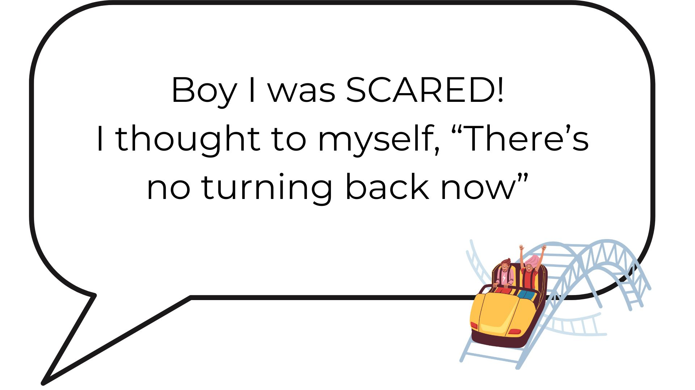 

![mic][mic]

---

![recording_8][recording_8]

Fantastic Job! We only have one more thing to do today.

Since you did so well reading the sentences earlier, let's try a few more. We're going to read a short story about a roller coaster ride called "The Caterpillar".
A sentence or two will appear on the screen – read it aloud as if you were reading any regular story book. If you're not sure about a word, just skip it and keep going. When you are ready, press "record".

---

Passage 8. When you are ready, press "record".

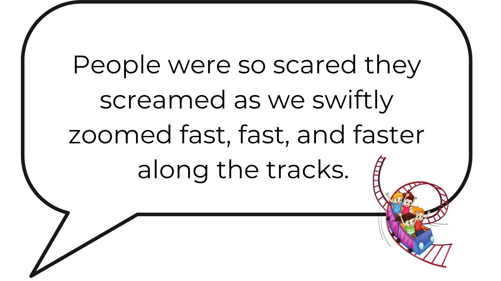 

![mic][mic]

---

![recording_9][recording_9]

Fantastic Job! We only have one more thing to do today.

Since you did so well reading the sentences earlier, let's try a few more. We're going to read a short story about a roller coaster ride called "The Caterpillar".
A sentence or two will appear on the screen – read it aloud as if you were reading any regular story book. If you're not sure about a word, just skip it and keep going. When you are ready, press "record".

---

Passage 9. When you are ready, press "record".

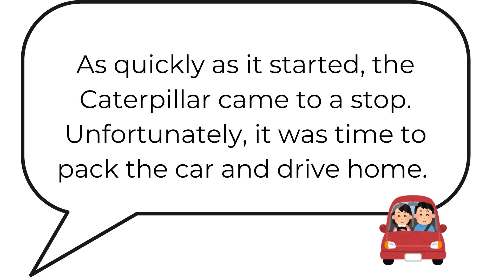 

![mic][mic]

---

![recording_10][recording_10]

Fantastic Job! We only have one more thing to do today.

Since you did so well reading the sentences earlier, let's try a few more. We're going to read a short story about a roller coaster ride called "The Caterpillar".
A sentence or two will appear on the screen – read it aloud as if you were reading any regular story book. If you're not sure about a word, just skip it and keep going. When you are ready, press "record".

---

Passage 10. When you are ready, press "record".

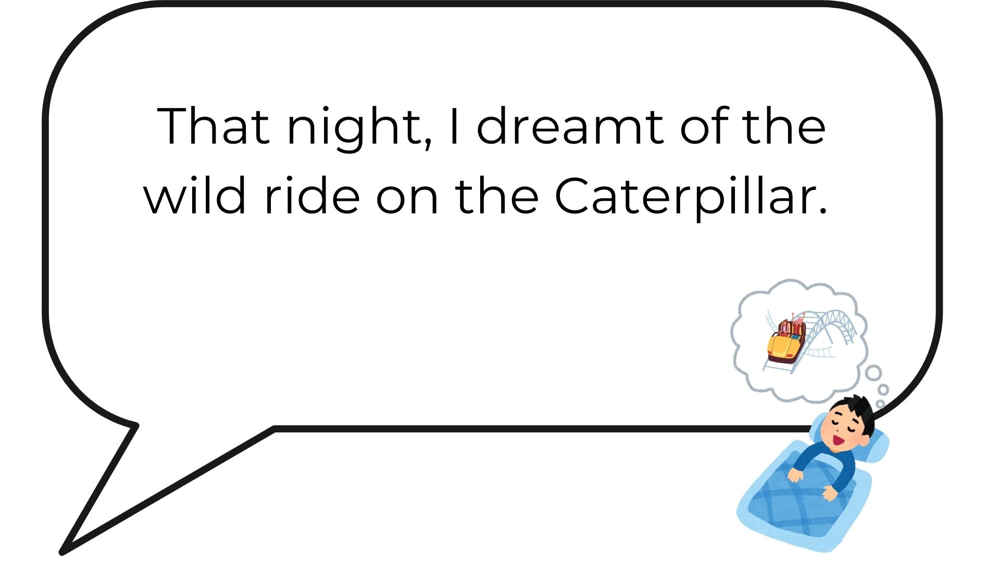 

![mic][mic]

---

![recording_11][recording_11]

Fantastic Job! We only have one more thing to do today.

Since you did so well reading the sentences earlier, let's try a few more. We're going to read a short story about a roller coaster ride called "The Caterpillar".
A sentence or two will appear on the screen – read it aloud as if you were reading any regular story book. If you're not sure about a word, just skip it and keep going. When you are ready, press "record".

---

Passage 11. When you are ready, press "record".

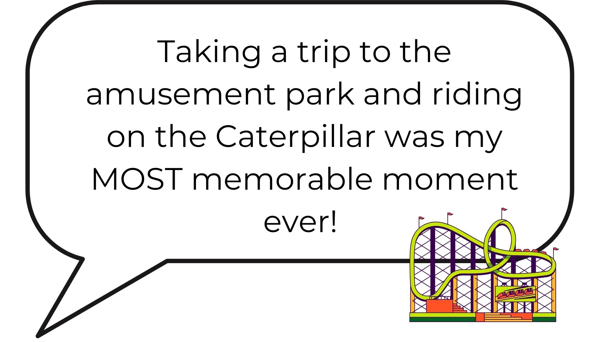 

![mic][mic]

---
