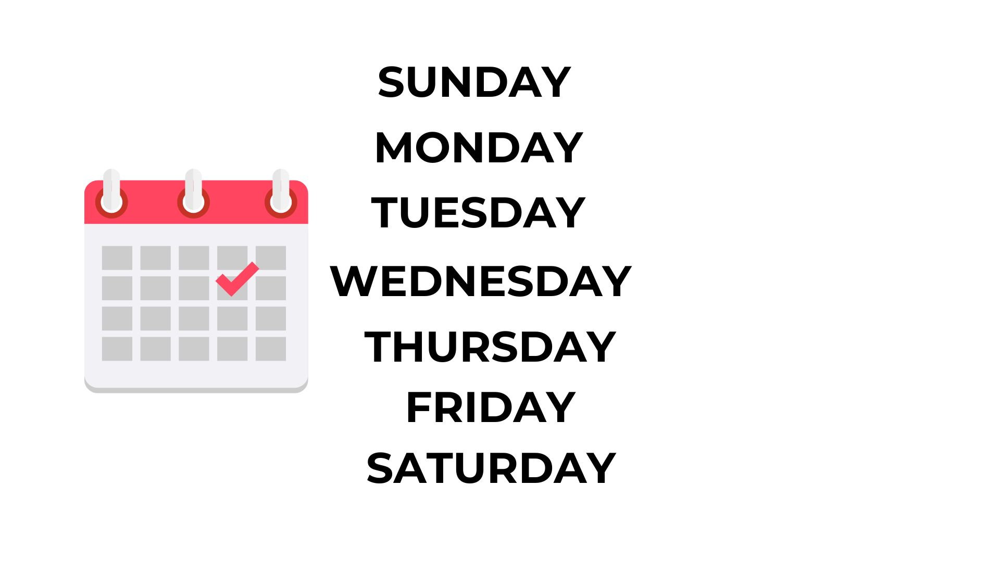
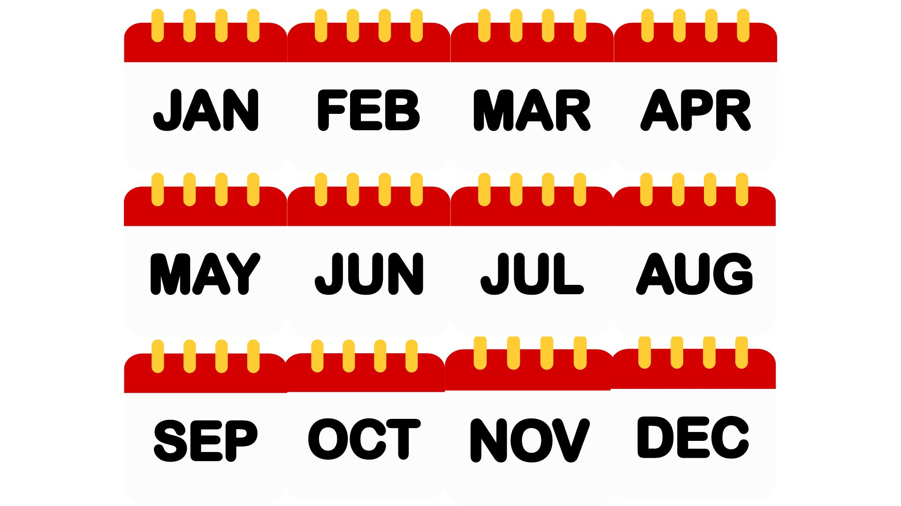
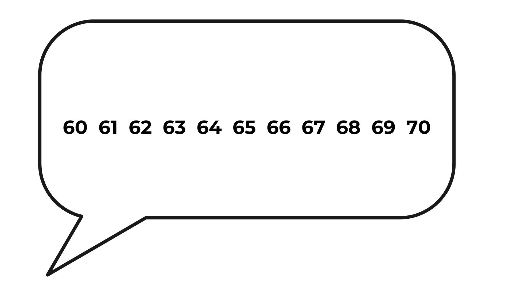

    
     
    Voice as a Biomarker of Health

[mic]: https://custom-icon-badges.demolab.com/badge/Press_to_Record-purple.svg?logo=mic&logoSource=feather
[recording_1]: https://custom-icon-badges.demolab.com/badge/Recording%201-Role%20naming%20tasks%20sounds--days-8A2BE2.svg?logo=b2ai_voice&logoColor=white
[recording_2]: https://custom-icon-badges.demolab.com/badge/Recording%202-Role%20naming%20tasks%20sounds--months-8A2BE2.svg?logo=b2ai_voice&logoColor=white
[recording_3]: https://custom-icon-badges.demolab.com/badge/Recording%203-Role%20naming%20tasks%20sounds--numbers-8A2BE2.svg?logo=b2ai_voice&logoColor=white

# Role naming tasks sounds

![recording_1][recording_1]

Thank you for sharing all of that information with me! It was super interesting Let's try some different questions – if you're not sure what the answer is, you can just move on to the next question.

---

Let's try some other questions that you probably already know the answers to. What are the days in the week (starting with Sunday)?

 

![mic][mic]

---

![recording_2][recording_2]

Thank you for sharing all of that information with me! It was super interesting Let's try some different questions – if you're not sure what the answer is, you can just move on to the next question.

---

I bet you know the months of the year too. Let's start with January... When you are ready, press "record"

 

![mic][mic]

---

![recording_3][recording_3]

Thank you for sharing all of that information with me! It was super interesting Let's try some different questions – if you're not sure what the answer is, you can just move on to the next question.

---

That was great Next can you count from 60 to 70? When you are ready, press "record".

 

![mic][mic]
