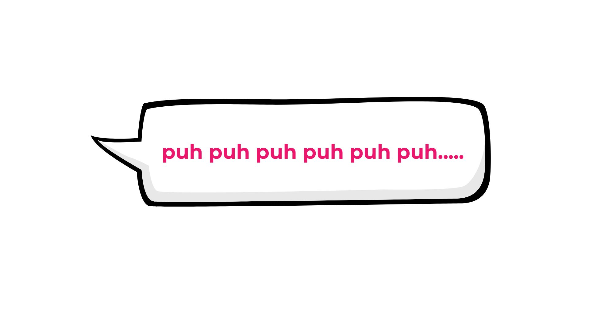
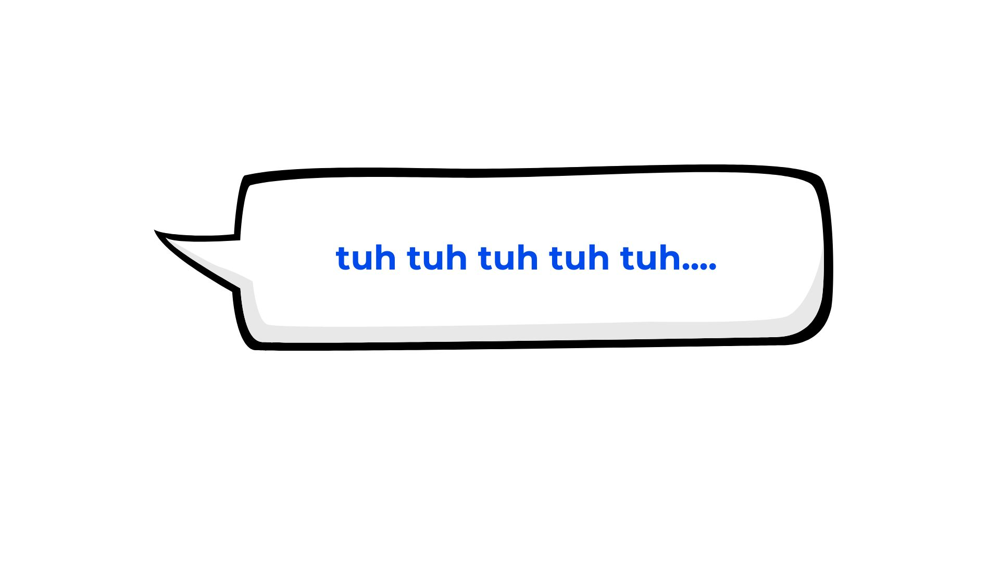
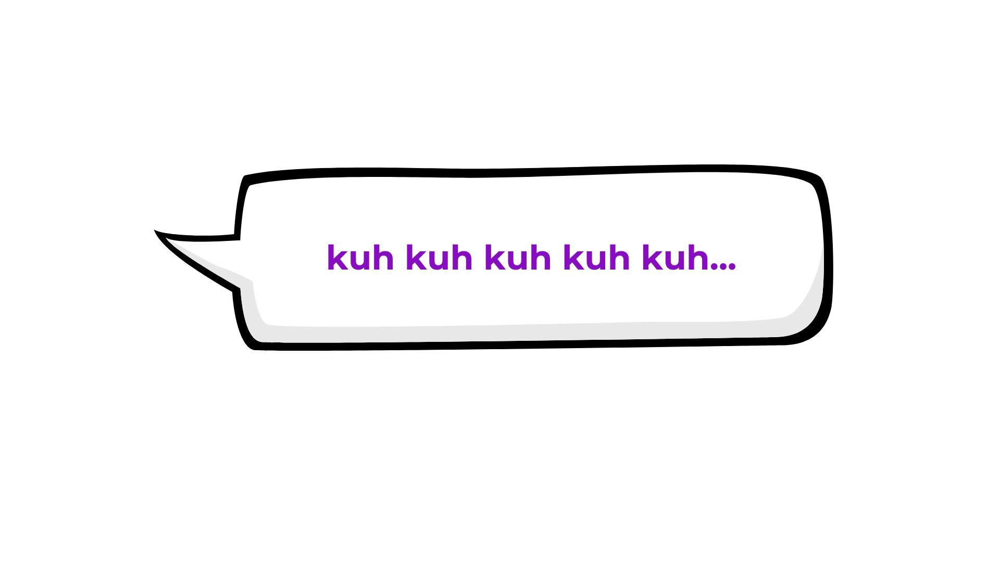
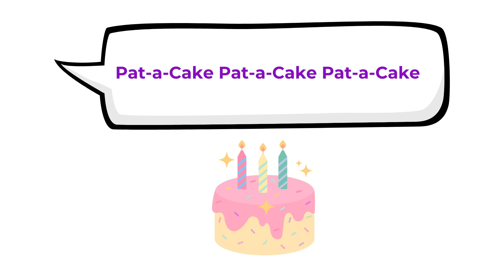

    
     
    Voice as a Biomarker of Health

[mic]: https://custom-icon-badges.demolab.com/badge/Press_to_Record-purple.svg?logo=mic&logoSource=feather
[video]: https://custom-icon-badges.demolab.com/badge/Video-red.svg?logo=youtube&logoSource=feather
[recording_1]: https://img.shields.io/badge/Recording%201-white
[recording_2]: https://img.shields.io/badge/Recording%202-white
[recording_3]: https://img.shields.io/badge/Recording%203-white
[recording_4]: https://img.shields.io/badge/Recording%204-white

# Silly Sounds

![recording_1][recording_1]

That was great! Let's try some more sounds – these let us see how your lips and tongue work together to make sounds and words.

---

First, we're going to say PUH PUH PUH over and over for about 5 seconds. Remember to take a breath if you need one! When you are ready, press "record".

 

![mic][mic]

---

![recording_2][recording_2]

That was great! Let's try some more sounds – these let us see how your lips and tongue work together to make sounds and words.

---

Next let's do the same thing, but this time say TUH TUH TUH... When you are ready, press "record".

 

![mic][mic]

---

![recording_3][recording_3]

That was great! Let's try some more sounds – these let us see how your lips and tongue work together to make sounds and words.

---

We've got one more to try. Tell me KUH KUH KUH... When you are ready, press "record".

 

![mic][mic]

---

![recording_4][recording_4]

That was great! Let's try some more sounds – these let us see how your lips and tongue work together to make sounds and words.

---

Fantastic! You did so well with those sounds, let's try to put them together and say PUH TUH KUH over and over until the timer stops. If that word seems a little too tricky, you can say PAT-A-CAKE over and over instead. When you are ready, press "record".

 

![mic][mic]

---
