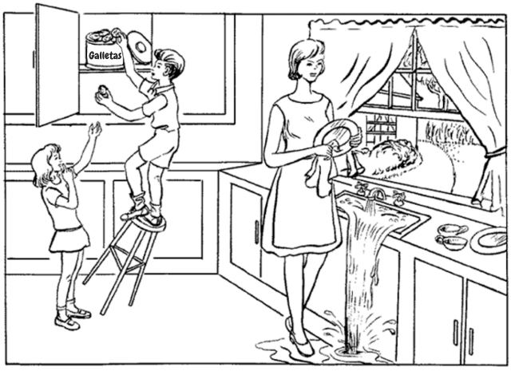
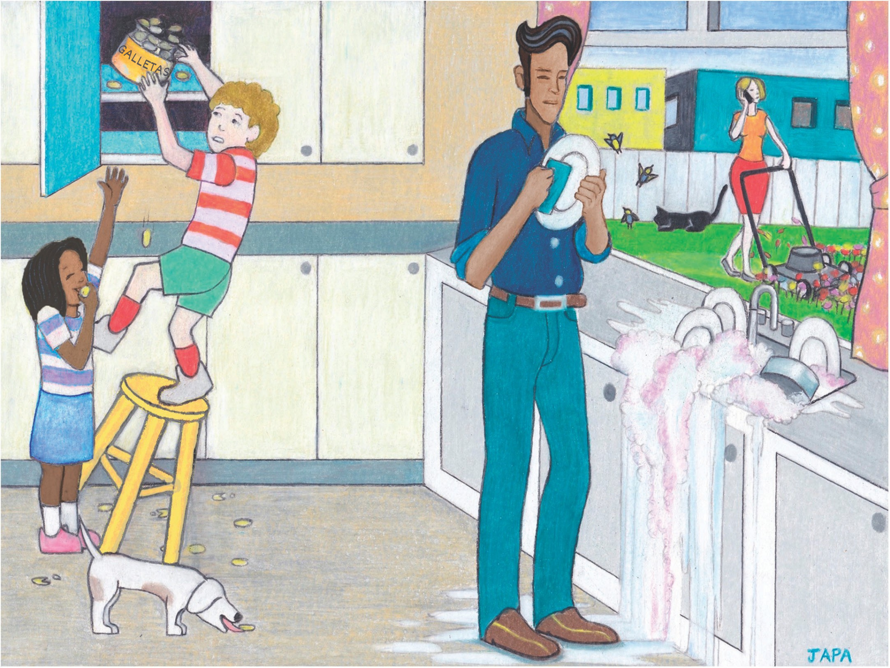

    
     
    Voice as a Biomarker of Health

[mic]: https://custom-icon-badges.demolab.com/badge/Presione_para_grabar-purple.svg?logo=mic&logoSource=feather
[recording_1]: https://img.shields.io/badge/Recording%201-white

[picture_descriptions]: https://custom-icon-badges.demolab.com/badge/Picture_Description_1_|_Picture_Description_2-darkgreen.svg?logo=image&logoSource=feather
[picture_description_1]:  https://custom-icon-badges.demolab.com/badge/Picture_Description_1-darkgreen.svg?logo=image&logoSource=feather
[picture_description_2]:  https://custom-icon-badges.demolab.com/badge/Picture_Description_2-darkgreen.svg?logo=image&logoSource=feather

# Descripción de la Imagen

![recording_1][recording_1]

Esta tarea nos ayuda a analizar características en su voz.

![picture_descriptions][picture_descriptions]

![mic][mic]

---

![picture_description_1][picture_description_1]

Dígame todo lo que ve que está ocurriendo en esta imagen.

---

![picture_description_2][picture_description_2]

Describa todo lo que está ocurriendo en la imagen (como si lo describiera para una persona ciega), tratando de usar oraciones completas.

