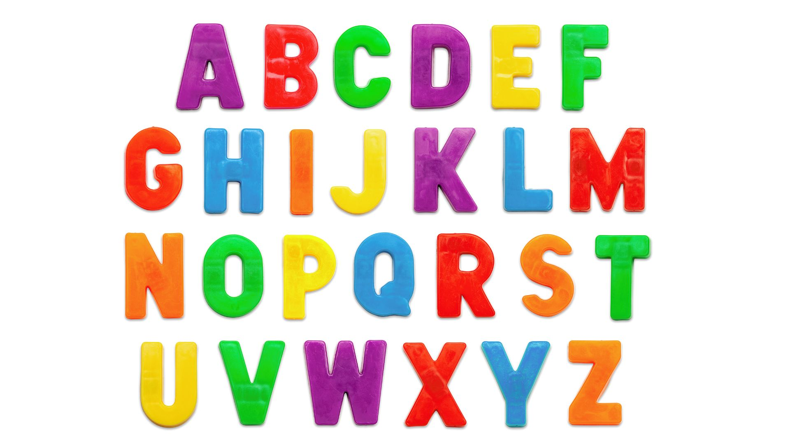
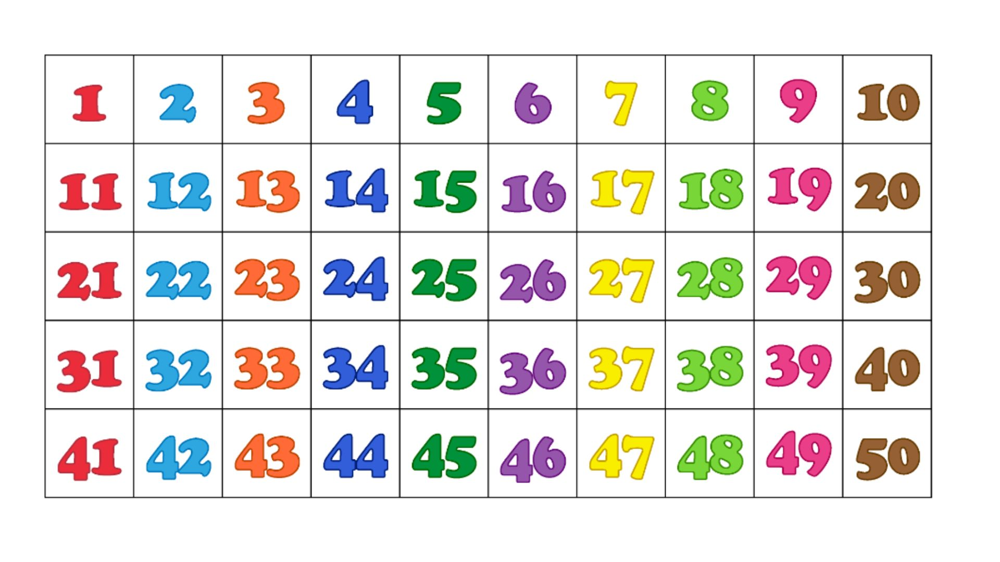

    
     
    Voice as a Biomarker of Health

[mic]: https://custom-icon-badges.demolab.com/badge/Press_to_Record-purple.svg?logo=mic&logoSource=feather
[recording_1]: https://img.shields.io/badge/Recording%201-white
[recording_2]: https://img.shields.io/badge/Recording%202-white

# Abcs and 123s

![recording_1][recording_1]

Wow! You found so many interesting things in that book! You probably know some letters and numbers too.

---

Let's sing our ABCs together! A,B... When you are ready, press "record".

 

![mic][mic]

---

![recording_2][recording_2]

Wow! You found so many interesting things in that book! You probably know some letters and numbers too.

---

Wow that was great! I wonder how high you can count? Let's start at 1, 2... When you are ready, press "record".

 

![mic][mic]

